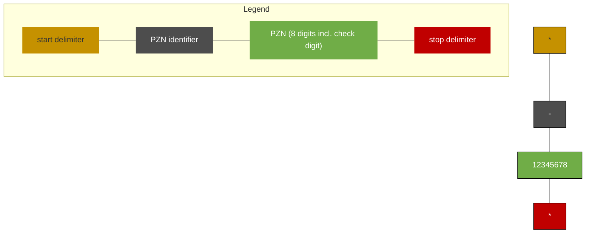

# Technical Information regarding PZN Coding
# – PZN in Code 39 –

IFA INFORMATION logo

## General Information

IFA GmbH allocates PZNs for pharmacy-typical products. The PZNs can be applied to the packaging or to the products themselves.

With the machine-readable and visual labelling of the PZN, the pharmaceutical companies comply with their obligation under Section 131 (5) SGB V to apply the medicinal products identifier (PZN) to the outer packaging of the medicinal products in a machine-readable format.

This document specifies the necessary details for coding the PZN in code 39.

## Contents

1. Scope .................................................................................................................................... 1
2. Coding of the PZN in Code 39 .............................................................................................. 1
3. Plain text line......................................................................................................................... 2
4. Code size .............................................................................................................................. 3
5. Readers................................................................................................................................. 4
6. Code placement on the packages ........................................................................................ 4
7. Print quality ........................................................................................................................... 5
8. Document Maintenance Summary........................................................................................ 5

## 1. Scope

The PZN should be printed in a machine-readable code on all pharmacy-only and pharmacy-typical goods, as pharmacies and pharmaceutical wholesalers work with the PZN as a product identifier.

For reimbursable products, the PZN must be printed in plain text near the code in addition to the barcode or Data Matrix Code.

Since the introduction of the Data Matrix Code (DMC), the PZN can also be affixed to the packs in Code 39 in accordance with the IFA and securPharm specifications for coding in the DMC. For pharmaceutical packs that have been marketed since 9 February 2019, the PZN in Code 39 can be omitted.

## 2. Coding of the PZN in Code 39

Code 39 is an alphanumeric barcode in which the numbers 0 through 9, 26 letters and 7 special characters can be encoded. Each of these characters implemented in the code consists of nine elements: five bars and four spaces. A space serves as separator between the individual characters.

<page_number>Seite 1 von 5</page_number>

01.04.2025 | V 2.3 Informationsstelle für Arzneispezialitäten – IFA GmbH <u>[Table of contents](Table of contents)</u>

Pharmazentralnummer as barcode in Code 39

IFA INFORMATION logo

Barcode example showing AB - 1234

Figure 1: Example - Code 39

The content of the code is “AB - 1234”.

The complete description of Code 39 can be found in the international standard ISO/IEC 16388.

The data structure for representing the PZN in Code 39 is as follows:

### \*-12345678\*

*   Code 39 start delimiter
*   PZN identifier persuant ISO/IEC 15418
*   PZN (8 digits incl. check digit)
*   Code 39 stop delimiter

Figure 2: data structure for representing the PZN in Code 39

The minus sign is internationally standardized as an identifier for the PZN in ISO/IEC 15418 and serves to identify the PZN. In practice, the correct capture is additionally verified by matching the PZN with the database and with the check digit. The last digit of the PZN is the check digit.

According to the standard, an additional character (denoted '*') is used for both start and stop delimiters. In plain text, there is no output of the start and stop characters provided.

## 3. Plain text line

To allow manual checking of the code and to facilitate a transmission of the PZN without code reading, the PZN is generally printed centered below the barcode in a well-readable font size (at least 6 pt. for a small code). The following structure applies to plain text line:

<page_number>Seite 2 von 5</page_number>

01.04.2025 | V 2.3 Informationsstelle für Arzneispezialitäten – IFA GmbH [Table of contents](Table%20of%20contents)

Pharmazentralnummer as barcode in Code 39

IFA INFORMATION logo

# PZN - 12345678

<table>
  <thead>
    <tr>
        <th>PZN</th>
        <th>-</th>
        <th>12345678</th>
    </tr>
  </thead>
  <tbody>
    <tr>
        <td>PZN designation</td>
        <td>blank minus sign blank</td>
        <td>PZN (8 digits incl. check digit)</td>
    </tr>
    <tr>
        <td colspan="3">PZN designation</td>
    </tr>
    <tr>
        <td> </td>
        <td>blank, minus sign, blank</td>
        <td> </td>
    </tr>
    <tr>
        <td> </td>
        <td> </td>
        <td>PZN (8 digits incl. check digit)</td>
    </tr>
  </tbody>
</table>

Figure 3: plain text line

Please note that the plain text line with plain text is distinct from the code content.

For visual identification, the term “PZN” precedes the number and the structural identifier is separated with a space for better readability. The spaces and the term “PZN” are not represented in the barcode (see above).

PZN barcode in Code 39

PZN - 12345678

Figure 4: Example - PZN in Code 39

# 4. Code size

The code size is oriented on the size of the corresponding packaging. The code size may vary within the limits stipulated by the parameter listed below.

Previous specifications specified three code sizes. These code sizes can still be used for guidance.

* **Module width**: For the “normal” code size, the module width is X = 0.25 mm. Permissible is a minimal width: Module width X = 187 µm and a maximum code size: Module width X = 450 µm.

* **Code size**: Considering the stipulated bar height and module width, the result is a nominal code size of about 10 x 40 mm. The minimum code size for the smallest packages is about 7 x 30 mm.

* **Ratio**: The nominal ratio (proportion of narrow to wide bar) should be 1:2.5. Permissible is 1:2 to 1:3.

* **Quiet zone**: The quiet zones should correspond at least 10 times to the module width X.

<page_number>Seite 3 von 5</page_number>

01.04.2025 | V 2.3 [spacer] Informationsstelle für Arzneispezialitäten – IFA GmbH [spacer] [Table of contents](Table_of_contents)

Pharmazentralnummer as barcode in Code 39

IFA INFORMATION logo

*   **Code height:** For a normal size of X = 0.25 mm, the code can be between 8 and 20 mm high. Greater heights increase the initial reading rate. The code height of nominally 10 mm changes proportionately to the nominal module width of X = 0.25 mm.

## 5. Readers

The barcode reader should have a nominal aperture of 0.15 mm (6 mil) and the minimum reading width should not be below 70 to 80 mm.

Using 2D scanners, linear codes (barcodes) also can be read without any problems, as long as the optical properties in terms of resolution and reading width correspond to the barcode reader properties.

## 6. Code placement on the packages

Since the coding of the PZN is to be affixed to the outer packaging of pharmaceuticals, this will predominantly affect folding cartons. The placement suggestions for folding cartons below are no obligatory standards but recommendations from which one can deviate for various reasons, as long as the code remains machine-readable.

Since the PZN in Code 39 can be applied in primary printing, the degrees of freedom in packaging design are relatively large. It is recommended to use one of the side surfaces for code placement. It should be done in such a manner that the length expansion of the code and PZN are affixed in parallel with the longitudinal edge (see example).

For centrally authorized pharmaceuticals in Europe, the PZN must be affixed in the "blue box".

Engineering drawing of a folding carton showing the placement of a PZN barcode on a side panel

Figure 5: Example - Placement of Code 39

<page_number>Seite 4 von 5</page_number>

01.04.2025 | V 2.3

Informationsstelle für Arzneispezialitäten – IFA GmbH

[Table of contents](Table of contents)

Pharmazentralnummer as barcode in Code 39

IFA INFORMATION logo

# 7. Print quality

Pursuant to ISO/IEC 15416, at least 1.5 (satisfactory) should be achieved. At least three measurements should be performed for each code. Fewer measurements for each code are allowed. However, the manufacturer must ensure that the minimum quality across the entire code height is complied with.

Note: If offset print with black bars is applied to a typical white folding carton, Grade 4 (= very good) can always be achieved without special effort. If only the minimum quality of 1.5 is achieved in this constellation, gross errors were made at the pre-press stage and during the printing execution. If plastics or films (transparent, metalized) are used for packaging, these materials often only allow the attainment of Grade 2 (= satisfactory).

The specifications of the Code 39 standard ISO/IEC 16388 must be observed.

*   **Permitted colours and substrate materials**: The substrate material must have an evenly diffusely reflecting surface. Strongly reflective surfaces (metallic, metallic effects) are inappropriate. Rough or embossed surfaces are also not suitable.

*   **Colour of the substrate material**: White, red, yellow or orange.

*   **Bar colour**: Black, blue or green. The minimum contrast requirements based on the satisfactory minimum quality of 1.5 in accordance with ISO/IEC 15416 must be observed for all colour combinations.

# 8. Document Maintenance Summary

<table>
  <thead>
    <tr>
        <th>Version</th>
        <th>Date</th>
        <th>Type of Change</th>
        <th>Change</th>
    </tr>
  </thead>
  <tbody>
    <tr>
        <td>V 2.1</td>
        <td>25.02.2019</td>
        <td>First release</td>
        <td> </td>
    </tr>
    <tr>
        <td>V 2.2</td>
        <td>28.09.2020</td>
        <td>Layout/text correction, Content</td>
        <td>Chapters: all</td>
    </tr>
    <tr>
        <td>V 2.3</td>
        <td>24.03.2025</td>
        <td>Layout/text correction, Content</td>
        <td>* Chapter <em>General Information</em> and Chapter 1, 4 and 5: editorial changes * Chapter 2:   - Minus sign standardardised   - Figure 2 modernised * Chapter 3:   - Terms plain text line and plain text harmonised   - Figure 3 modernised   - In Figure 4, insert a space after the minus sign * Chapter 6:   - In Figure 5, insert a space after the minus sign</td>
    </tr>
  </tbody>
</table>

<page_number>Seite 5 von 5</page_number>

01.04.2025 | V 2.3	Informationsstelle für Arzneispezialitäten – IFA GmbH	[Table of contents](Table%20of%20contents)