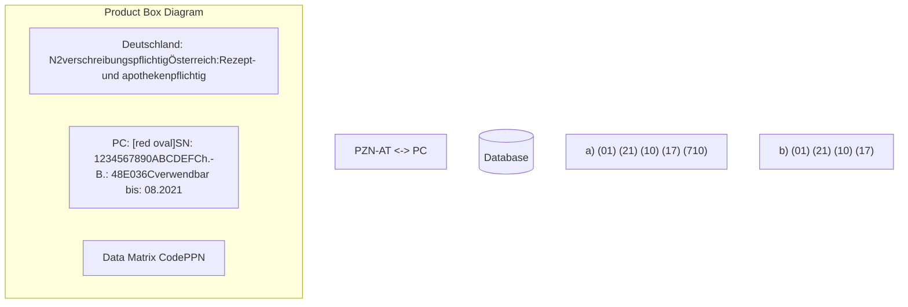
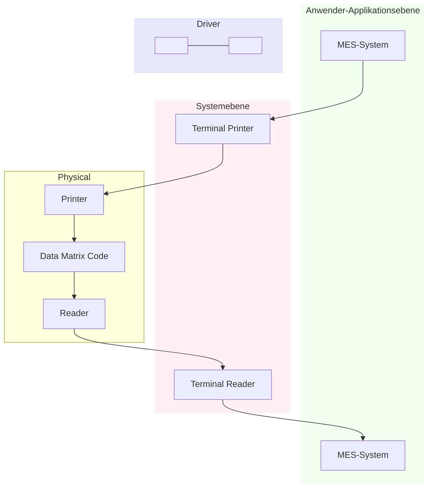

# IFA Coding System

# PPN-Code Specification for Retail Packaging

Coding of medicinal products in accordance with the EU Falsified Medicines Directive 2011/62/EU and the Delegated Regulation (EU) 2016/161

Automatic identification of articles in the supply chain of the health care system

Illustration of a medicine box for Tripapolon Fort with a magnifying glass showing a Data Matrix code and human-readable data including PC, SN, Ch.-B., and expiry date.

securPharm logo

IFA CODINGSYSTEM logo

**Version:** 3.06

**Date of issue:** 6<sup>th</sup> November 2023

The editor points out these specifications were generated to the best of his knowledge based on the current findings at the time of printing.

Due to open legal and technical questions and the possibly required adjustment of social law requirements and others, future modifications and adjustments cannot be excluded, which means that this right must be expressly reserved.

For additional information on IFA please visit www.ifaffm.de/en.

© Informationsstelle für Arzneispezialitäten – IFA GmbH **|** English V 3.06

<page_number>Page 2</page_number>

IFA CODINGSYSTEM logo

# Contents

1 Introduction ................................................................................................................................. 5
2 Scope .......................................................................................................................................... 6
3 Notes on verification ................................................................................................................... 7
3.1 Verification labels....................................................................................................................... 7
3.2 Serial number rules ................................................................................................................... 7
3.3 Data transfer to the database system of the pharmaceutical industry ....................................... 7
3.4 Anti-tampering device ............................................................................................................... 8
3.5 Assignment of pharmaceuticals subject to mandatory verification ........................................... 8
4 Coding agreements .................................................................................................................... 9
4.1 Article labelling with PZN and PPN........................................................................................... 9
4.1.1 General...................................................................................................................................... 9
4.1.2 Central Pharmaceutical Number (Pharmazentralnummer - PZN) ............................................. 9
4.1.3 Pharmacy Product Number (PPN)........................................................................................... 10
4.2 Pharmacy Product Number (PPN) ........................................................................................... 11
4.3 National Trade Item Number (NTIN) ....................................................................................... 11
4.4 An overview of codes and data content .................................................................................. 12
4.5 Multi-market packs ................................................................................................................. 13
4.6 Clinic packs.............................................................................................................................. 16
4.7 Free samples ........................................................................................................................... 17
4.8 Mass market/drugstore products............................................................................................ 18
5 Data content and requirements for the Data Matrix Code......................................................... 19
5.1 Data identifiers and structures................................................................................................. 19
5.2 Single Market Packs – Data elements and corresponding data identifiers/application
identifiers ................................................................................................................................. 19
5.2.1 Product code........................................................................................................................... 19
5.2.2 Serial number .......................................................................................................................... 20
5.2.3 Batch number.......................................................................................................................... 20
5.2.4 Expiry date .............................................................................................................................. 20
5.2.5 Additional data elements - Example of a URL......................................................................... 20
5.3 Multi-market packs – Data elements and associated data identifiers ..................................... 21
5.3.1 General.................................................................................................................................... 21
5.3.2 Country-specific identifier in GS1 format ................................................................................ 21
5.3.3 Country-specific identifier in ASC format ................................................................................ 22
6 Marking with code and clear text.............................................................................................. 23
6.1 Symbology .............................................................................................................................. 23
6.2 Matrix size ............................................................................................................................... 23
6.3 Code size and quiet zone ........................................................................................................ 24
6.4 Positioning of the Data Matrix Code ....................................................................................... 24
6.5 Data Matrix Code emblem ...................................................................................................... 24
6.6 Clear text information ............................................................................................................. 25

<page_number>Page 3</page_number>

© Informationsstelle für Arzneispezialitäten – IFA GmbH | English V 3.06

IFA CODINGSYSTEM logo

6.6.1 General 25
6.6.2 PZN 25
6.6.3 Product code and serial number 25
6.6.4 Batch number and expiry date 25
6.6.5 Examples 26
7 Quality check of the Data Matrix Code 27
8 Interoperability based on XML standards 28
Appendix A – Overview and reference of identifiers 29
Appendix B – Code emblem 31
Appendix C – Interoperability based on XML descriptors (informative) 32
C.1 General 32
C.2 Data Format Identifier (DFI) 32
C.3 XML-Node for Data 33
C.4 Implementation 33
C.5 Examples 34
Appendix D – Details for quality inspection of the Data Matrix Code 35
D.1 General 35
D.2 Code scanning check 35
D.2.1 Manual code scanning check 35
D.2.2 Inline code scanning inspection 35
D.3 Measurement in accordance with ISO/IEC 15415 36
D.4 Measuring conditions according to ISO/IEC 15415 36
D.5 Parameters for print quality 36
Appendix E – Glossary/Abbreviations 38
Appendix F – Bibliography 42
F.1 Standards 42
F.2 Reference to specifications 42
Appendix G – Document Maintenance Summary 43
Imprint 44

© Informationsstelle für Arzneispezialitäten – IFA GmbH | English V 3.06 <page_number>Page 4</page_number>

IFA CODINGSYSTEM logo

# 1 Introduction

Pursuant to Section 131 para. 4 and 5 of German Social Code Book V (SGB V) and the corresponding master agreement, which was concluded between the relevant trade associations of the pharmaceutical industry and the National Association of Statutory Health Insurance Funds (GKV-Spitzenverband), marketing authorisation holders and other manufacturers are obligated to transmit the required information (pricing and product information) for their pharmaceuticals and products, which can be prescribed at the expense of statutory health insurance funds in accordance with the guidelines pursuant to Section 92 para. 1 clause 2 no. 6. This information is required for creating pharmacological/therapeutic and price-related transparency and for fulfilling the legally mandated tasks of the health insurance funds and their associations. Furthermore, they must affix a nationally uniform identifier according to Section 300 para. 3 clause 1 no. 1 of German Social Code Book V (SGB V) on the outer packaging of pharmaceuticals and products that can be prescribed at the expense of statutory health insurance funds in accordance with the guidelines in Section 92 para. 1 clause 2 no. 6. Based on Section 131 para. 1 and 5 of German Social Code Book V (SGB V), the master agreement specifies the legal obligations, designates the Central Pharmaceutical Number (Pharmazentralnummer - PZN) as the nationally uniform identifier and governs the requirements regarding machine readability.

The market participants and social partners of the German health care system, specifically the partners to the master agreement pursuant to Section 131 and Section 300 of German Social Code Book V (SGB V), have implemented the legal requirements by stipulating the PZN as the nationally uniform pharmaceutical identifier in machine-readable format and a unique key. As a result, each package<sup>1</sup> with its features of article designation, provider, dosage form, package size including quantity and unit, article type and the pharmaceutical label "Arzneimittel" is clearly identifiable. The PZN is assigned by "Informationsstelle für Arzneispezialitäten – IFA GmbH (IFA)" based on uniform rules. IFA safeguards unambiguous identification over the entire product lifecycle. As a registered issuing agency in accordance with ISO/IEC 15459-2, it also ensures the internationally unambiguous identification of the PZN by embedding it in the Pharmacy Product Number (PPN).

All data transmissions and affixing the nationally uniform pharmaceutical identifier in machine-readable format necessitate specific requirements in terms of coding and clear text information (HRI – human readable interpretation). These requirements are described in this document.

Apart from assigning the PZN/PPN, the IFA records and normalises the data reported by the marketers responsible (marketing authorisation holders, manufacturers, providers) in a database. This IFA database contains business, legal and logistic information on pharmaceuticals, medical devices and other merchandise typically sold in pharmacies. The data in the IFA database are issued in the form of IFA Information Services to authorised data recipients and represent a central pillar of information in the health care system, specifically for service providers, health insurance funds, trade and authorities, and serve the purpose of ensuring safe pharmaceutical care for patients.

For marketing authorisation holders, additional labelling requirements in machine-readable format as well as in a format readable by humans result from the Falsified Medicines Directive 2011/62/EU (FMD) and the DELEGATED REGULATION (EU) 2016/161 OF THE COMMISSION dated 2 October 2015 (DR). Furthermore the manufacturers of medical devices must adhere to the labelling provisions of REGULATION (EU) 2017/745 OF THE EUROPEAN PARLIAMENT AND THE COUNCIL of 5 April 2017 (MDR). It is the objective of the MDR to ensure unambiguous labelling and traceability of medical devices with the help of unique device identification (UDI).

<sup>1</sup> This document treats the terms "package", "retail package", "item" or "article" synonymously. In combination with pharmaceuticals/finished medicinal products, the term "pharmaceutical package" is also used. If one is referring to a specific, individual package, which is equipped e.g. with a certain serialisation number, the term "individual" or "serialised package" is used.

<page_number>Page 5</page_number>

© Informationsstelle für Arzneispezialitäten – IFA GmbH | English V 3.06

IFA CODINGSYSTEM logo

The specific requirements for coding and clear text information as well as the technical details are described in these specifications. They were generated on behalf of the associations that represent IFA:

* **ABDA – Bundesvereinigung Deutscher Apothekerverbände e. V.**
* **Bundesverband der Arzneimittel-Hersteller e. V. (BAH)**
* **Bundesverband der Pharmazeutischen Industrie e. V. (BPI)**
* **Bundesverband des Pharmazeutischen Großhandels – PHAGRO e. V.**
* **Pro Generika e. V.**
* **Verband Forschender Arzneimittelhersteller e. V. (vfa)**

Packaging hierarchy diagram showing individual medicine packs, boxes, and a pallet

Figure 1: Packaging hierarchy
(Image source: According to ISO TS 16791)

# 2 Scope

The <u>Transport Logistics specifications</u><sup>3</sup> are available on the IFA website.

This document represents the specifications for the identification of retail packages (the articles) - see arrow in Figure 1 - which are the responsibility of the marketing authorisation holders pursuant to Section 131 para. 4 and 5 of the German Social Code Book V (SGB V). This also takes into account requirements arising from the FMD and the MDR.

A key part of these specifications is the description of the Data Matrix Code, which is used as the data carrier for the machine-readable capture of all retail packages. It contains all required data elements. The following chapters describe the details regarding data structure; coding (e.g. code size and print quality) as well as the stipulations for labelling in clear text.

The content of these specifications matches those of the “CODING RULES FOR MEDICINES REQUIRING VERIFICATION FOR THE GERMAN MARKET” issued by securPharm e. V. (securPharm Coding Rules).

Application of these specifications by marketing authorisation holders and manufacturers who label products and by those who capture data is mandatory. This creates the prerequisite for robust and secure processes with all parties involved.

It has been ensured that, if these specifications are applied, all of securPharm’s requirements are met as well.

Details to use of the IFA Coding System for medical devices in accordance with Regulations (EU) 2017/745 and (EU) 2017/746 are to be found in "<u>Specification Unique Device Identification (UDI)</u>"<sup>2</sup>.

<sup>2</sup> [https://www.ifaffm.de/mandanten/1/documents/04_ifa_coding_system/IFA-Info_Spec_UDI_Code_EN.pdf](https://www.ifaffm.de/mandanten/1/documents/04_ifa_coding_system/IFA-Info_Spec_UDI_Code_EN.pdf)

<sup>3</sup> [https://www.ifaffm.de/en/ifa-codingsystem/data-matrix-code-retailpacks.html](https://www.ifaffm.de/en/ifa-codingsystem/data-matrix-code-retailpacks.html)

© Informationsstelle für Arzneispezialitäten – IFA GmbH | English V 3.06 <page_number>Page 6</page_number>

IFA CODINGSYSTEM logo

# 3 Notes on verification

The following subchapters contain notes on additional elements and processes that are closely linked to coding.

## 3.3 Data transfer to the database system of the pharmaceutical industry

## 3.1 Verification labels

For pharmaceuticals destined for the German market, verification will be conducted via the German database system of the pharmaceutical industry (also known as the ACS MAH system), which is operated by ACS PharmaProtect GmbH. The basic prerequisite for the verification process is the successful transmission of the pack data to the system. The pack data contain the following key data elements:

In the IFA database (product master data), the verification indicators (Verifizierungskennzeichen) are assigned to the article/PZN in question and are as follows:

* “Verifizierung im Pflichtbetrieb ab Hochladedatum” (VKZ-H - Verification in mandatory operations from upload date) and

* Product code (either in PPN or NTIN format)

* Serial number

* Batch number

* Expiry date

* “Verifizierung im Pflichtbetrieb ab Verfalldatum” (VKZ-V - Verification in mandatory operations from expiry date)

Apart from the above-mentioned key elements, the marketing authorisation holder (MAH) must transmit additional information (so-called product master data) pursuant to Art. 33 of the DR, among others the marketing authorisation holder pursuant to Art. 33 para 2 g) of the DR.

With these verification labels, pharmaceuticals subject to mandatory verification should be recognizable as such and ensure that pharmaceutical packs released and entering the market prior to 9 February 2019 (existing merchandise) can be dispensed without verification.

The MAH can upload the pack data for products exclusively destined for the German market as well as for multi-market packs solely via the EU-Hub into the German database system of the pharmaceutical industry (ACS MAH system). The package data are uploaded to the European Medicines Verification Organisation (EMVO) via the interface of the so-called EU-HUB.

Details<sup>4</sup> on these labels and regarding notification to IFA are available on the IFA website.

## 3.2 Serial number rules

Pursuant to Article 4 of the Delegated Regulation (EU) 2016/161 (DR), the serial number required for verification is a numeric or alphanumeric sequence of a maximum of 20 characters generated by the marketing authorisation holder (MAH). To make matters as difficult as possible for forgers, these serial numbers assigned by the MAH must be generated by a deterministic or non-deterministic randomisation algorithm. In any case, the probability of deriving a serial number must be lower than 1:10,000. In addition, the randomised serial number in combination with the product code based on the PZN must be unique for each pharmaceutical pack for a period of at least one year after the pack’s expiry date or at least five years after the pharmaceutical has been released for sale or distribution (the longer time period shall apply).

Reusing serial numbers represents a potential error source and is therefore not recommended.

<sup>4</sup> [https://www.ifaffm.de/en/ifa-suppliers.html](https://www.ifaffm.de/en/ifa-suppliers.html)

<page_number>Page 7</page_number>

© Informationsstelle für Arzneispezialitäten – IFA GmbH | English V 3.06

IFA CODINGSYSTEM logo

The product master data stipulated by the EMVO must always be uploaded via the EU Hub. Additional information on uploading product master data via the EU Hub are available in the “EMVS Master Data Guide” on the EMVO website<sup>5</sup>.

For more detailed information on the organisational and technical connection to the database system of the pharmaceutical industry by ACS PharmaProtect GmbH, please visit [http://www.pharmaprotect.de/en](http://www.pharmaprotect.de/en).

In any case, the MAH needs the contract with the EMVO and with ACS PharmaProtect GmbH as a prerequisite for Europe-wide verification. The contracts allow the MAH to use the systems.

In order to avoid conflict situations, we recommend that MAHs carry out the PZN allocations by IFA GmbH, the access to the ACS MAH system and uploading product master data to the EU Hub.

In reference to the corresponding PZN, the required product master data are directly transmitted to the ACS MAH system by IFA GmbH. Based on these master data, the MAH’s authorisation to upload pack data is derived via the assignment of the PZN to the IFA supplier number. Therefore, when uploading via the EU Hub, correct entry of the five-digit<sup>6</sup> IFA supplier number in the field “MAH ID” is obligatory.

## 3.4 Anti-tampering device

On 11 April 2017, the BfArM and the PEI stated in a joint announcement that the anti-tampering device may also be voluntarily affixed to pharmaceuticals that are not affected by the Falsified Medicines Directive:

With EMVO master data, the PZN must always be entered in the field “National Code” for pharmaceuticals placed on the market in Germany. This applies equally to multi-market packs (MMP) and single-market packs (SMP).

“[...] For pharmaceuticals for which affixing of the anti-tampering device is not mandatory pursuant to Article 54a para. 1 of Directive 2001/83/EC, marketing authorisation holders can already affix the anti-tampering device for patient protection and to recognise potential manipulation on a voluntary basis at this point or after the above-mentioned effective date. [...]”

Since the verification process is based on the PZN as a key element, only those pharmaceutical packs can participate in verification to which a PZN was assigned and for which the above-mentioned verification labels have been reported for issue in the IFA information services.

For the complete and certified text of the announcement, please visit the PEI website. The announcement can also be read in the Federal Gazette (Bundesanzeiger).

## 3.5 Assignment of pharmaceuticals subject to mandatory verification

The higher federal authorities PEI and BfArM have classified pharmaceuticals that must bear the safety features pursuant to the DR accordingly in the public part of the AMIS Database. Pharmaceutical companies can check the classifications and contact Department 1 at the BfArM via email, if there are discrepancies.

<sup>5</sup> www.emvo-medicines.eu/knowledge-database

<sup>6</sup> With leading zeros, if necessary.

© Informationsstelle für Arzneispezialitäten – IFA GmbH | English V 3.06

<page_number>Page 8</page_number>

IFA CODINGSYSTEM logo

# 4 Coding agreements

## 4.1 Article labelling with PZN and PPN
### 4.1.1 General

Coding serves the purpose of clearly identifying packages (articles) in order to be able to assign additional properties, such as price, prescription-only status and classification as a narcotic, to each item via merchandise management systems. There are equivalent terms for identification, such as "product code" (PC), which originated from the DR, or "item number" or "product number" which are often used in merchandise management systems, or "device identification" (DI), which is used in the UDI system for medical devices. These specifications use the term "article number" in general or whichever term is used in the context in question.

For articles that are distributed in different markets in parallel, it is customary to issue multiple article numbers to the same article, which are specifically assigned to the market in question. This applies e.g. to cross-national multi-market packs, for dental products that are subject to mandatory verification or for merchandise typically sold in pharmacies that is also sold in drugstores. In these cases, the article carries multiple designations that are included in one or multiple codes. One particular role is played by the National Healthcare Reimbursement Numbers (NHRN), which are customarily used as independent article numbers or applied additionally as internationally unique article numbers.

For the German market, the situation is governed in a clear-cut and user-friendly manner, since the PZN is the leading article key in the merchandise management systems that serves the purposes of logistics, billing and cost reimbursement as well as the requirements of pharmaceutical law. Depending on the situation and process environment, the PZN is used either as an 8-digit key or enveloped in a PPN or NTIN. More details are described in the following chapters.

### 4.1.2 Central Pharmaceutical Number (Pharmazentralnummer - PZN)

Since 1968, the Central Pharmaceutical Number (Pharmazentralnummer - PZN)<sup>7</sup> has been used for the unambiguous identification and labelling of articles. As primary key, it is anchored in various systems. The Healthcare Reform Act (GRG) of 20 December 1988 required machine readability and Code 39 was stipulated as symbology. The PZN originally had 7 digits but has been an 8-digit number since 2013<sup>8</sup>. Based on a leading zero, the previous 7-digit numbers were expanded to 8 digits. The PZN is structured as follows:

<table>
  <thead>
    <tr>
        <th colspan="2">Pharmazentralnummer (PZN)</th>
    </tr>
  </thead>
  <tbody>
    <tr>
        <td><u>1234567</u></td>
        <td>8</td>
    </tr>
    <tr>
        <td>individual number - issued by IFA</td>
        <td>check digit</td>
    </tr>
  </tbody>
</table>

Following the assignment rules, the IFA assigns the PZN to providers as sequential numbers. This PZN will remain assigned to the article in question of its entire lifecycle, even when the rights to this article are assigned to other providers. There is no recycling of numbers that were previously assigned.

Section 300 para. 1 no. 1 of German Social Code Book V (SGB V) obligates pharmacists to transfer the identifier to be used pursuant to para. 3 no. 1 in machine-readable format to the prescription sheet (Muster 16), which must be used for statutory healthcare, and to the electronic prescription record when dispensing finished medicinal products to insured patients. The 8-digit PZN must be used in this case. This identifier is unambiguous at the national level. As a result, existing processes will be preserved without change.

<sup>7</sup> The PZN assigned by IFA must not be confused with the numbers assigned by the corresponding Austrian organisations. This "Austrian" PZN has seven digits including the check digit.

<sup>8</sup> After 1 January 2020, only packages with the 8-digit PZN version can be marketed.

<page_number>Page 9</page_number>

© Informationsstelle für Arzneispezialitäten – IFA GmbH | English V 3.06

IFA CODINGSYSTEM logo

The coding requirements of the PZN in Code 39 are described in the IFA document “<u>Technical Information PZN Coding – PZN in Code 39</u>”. The IFA document “<u>Technical Information PZN Coding - Check Digit Calculations</u>” shows how the check digit is calculated. For the stipulations regarding clear text, see <u>Chapter 6.6</u>.

The PZN becomes internationally unambiguous based on the “envelope” in the form of the PPN or NTIN described in the following chapters.

Existing databases and software systems can algorithmically generate a PZN from the PPN or the NTIN or, conversely, a PPN or NTIN from the PZN.

## 4.1.3 Pharmacy Product Number (PPN)

In the form of the PPN, the PZN becomes internationally unambiguous based on the Product Registration Agency Code (PRA Code) that precedes it. This unambiguity is legally mandated, e.g. when labelling articles in accordance with the DR and the MDR.

The PPN is listed as a data element with the data identifier **“9N”** in the ISO/IEC 15418 (ANSI MH10.8.2) standard. As an issuing agency, the IFA is accredited in accordance with ISO/IEC 15459-2. As a result, the PPN meets the technical and formal requirement for international unambiguity.

The table below shows the PRA Codes registered for the PPN:

<table>
  <thead>
    <tr>
        <th>PRA-Code</th>
        <th>Assigned to</th>
        <th>Reserved for</th>
        <th>Used for</th>
    </tr>
  </thead>
  <tbody>
    <tr>
        <td>00-09</td>
        <td colspan="3">Reserved</td>
    </tr>
    <tr>
        <td>10</td>
        <td colspan="2">GS1</td>
        <td>GTIN/NTIN</td>
    </tr>
    <tr>
        <td>11</td>
        <td>IFA; Germany</td>
        <td> </td>
        <td>PZN - medicinal and other pharmacy products Germany</td>
    </tr>
    <tr>
        <td>12</td>
        <td colspan="2">EUROCODE IBLS</td>
        <td>Registered Blood Product Number</td>
    </tr>
    <tr>
        <td>13</td>
        <td>IFA; Germany</td>
        <td> </td>
        <td>HPC - Health Product Code, administered by Companies</td>
    </tr>
    <tr>
        <td>14</td>
        <td> </td>
        <td>Association Pharmaceutique Belge (APB)</td>
        <td>CNK code</td>
    </tr>
    <tr>
        <td>15</td>
        <td> </td>
        <td>Italian Ministry of Health</td>
        <td>AIC code</td>
    </tr>
    <tr>
        <td>16</td>
        <td> </td>
        <td>Austria Association of Pharmacists</td>
        <td>PZN-Austria</td>
    </tr>
    <tr>
        <td>17</td>
        <td colspan="2">INFARMED</td>
        <td>Portugal Registration Number of Medicine Presentation</td>
    </tr>
    <tr>
        <td>18</td>
        <td colspan="2">Z-Index; Netherland</td>
        <td>Z-Index - pharmaceutical products Netherland</td>
    </tr>
    <tr>
        <td>19</td>
        <td>NENSI d.o.o.; Slovenia</td>
        <td> </td>
        <td>NENSI code - pharmaceutical products Slovenia</td>
    </tr>
    <tr>
        <td>20</td>
        <td>CIP; France</td>
        <td> </td>
        <td>CIP Code - medicinal products France</td>
    </tr>
    <tr>
        <td>21</td>
        <td>CIP; France</td>
        <td> </td>
        <td>CIP Code - pharmaceutical services France</td>
    </tr>
    <tr>
        <td>22</td>
        <td>ACL; France</td>
        <td> </td>
        <td>ACL Code - other pharmacy products France</td>
    </tr>
    <tr>
        <td>23</td>
        <td>ACL; France</td>
        <td> </td>
        <td>ACL Code - pharmaceutical services France</td>
    </tr>
    <tr>
        <td>24</td>
        <td>CIP; France</td>
        <td> </td>
        <td>UCD Code - common dispensing unit of medicinal products France</td>
    </tr>
    <tr>
        <td colspan="4">25-99</td>
    </tr>
    <tr>
        <td>MA</td>
        <td>IFA; Germany</td>
        <td> </td>
        <td>Master UDI-DI - medical devices</td>
    </tr>
    <tr>
        <td colspan="4">AA-ZZ</td>
    </tr>
  </tbody>
</table>

Figure 2: PRA Code table

<page_number>Page 10</page_number>

© Informationsstelle für Arzneispezialitäten – IFA GmbH | English V 3.06

IFA CODINGSYSTEM logo

Additional information can be accessed under IFA Coding System<sup>9</sup>.

## 4.2 Pharmacy Product Number (PPN)

As shown below, the PZN is embedded into the globally unambiguous format of a PPN.

Pharmacy Product Number (PPN) diagram showing the structure: 11 (Product Registration Agency Code for PZN), 12345678 (PZN), and 42 (Check-Digits PPN).

The PPN consists of three parts that are highlighted in red, blue and green. The "11" stands for a Product Registration Agency Code (PRA Code). This code is managed and assigned by IFA. The "11" is assigned for the German PZN. The national article number follows after the "11" and is represented in blue. This is the unmodified PZN (8 digits). The subsequent digits (shown in the figure in green) form the two-digit, calculated check number of the PPN across the entire data field (including the "11"). This together with the PZN represented in this example results in a value of "42".

The use of the PPN is available to all users, the license is free.

## 4.3 National Trade Item Number (NTIN)

As shown below, the PZN is embedded into the globally unambiguous format of a NTIN<sup>10</sup>.

National Trade Item Number (NTIN) diagram showing the structure: 0, 4150 (GS1-Prefix for PZN), 12345678 (PZN), and 2 (Check-Digit NTIN).

The NTIN consists of three parts that are highlighted in red, blue and green. The "4150" is the prefix assigned for the PZN by GS1 Germany. The unmodified PZN (8 digits), represented in blue, follows. The last digit (shown in the figure in green) represents the check digit across the entire data field. Detailed information on the NTIN and the generation of the check digit can be found in the NTIN Guideline<sup>11</sup> of GS1.

In addition, the NTIN must be prefixed by a "0" to generate a 14-digit format for this application.

In both its technical form and logistic application, the NTIN formed in this manner is a full Global Trade Item Number (GTIN). The different term "NTIN" merely points out the difference in the assignment of the GTIN: While the part of the GTIN that follows the prefix assigned by GS1 (country and manufacturer ID) is typically assigned by the "manufacturer" (supplier) himself for an individual item ID, this part is instead assigned centrally by a national entity for an NTIN. For an NTIN used in Germany, this will be the PZN assigned by IFA.

<sup>9</sup> www.ifaffm.de/en/ifa-codingsystem.html

<sup>10</sup> Unless stated otherwise, these specifications understand the term NTIN or NTIN-DE to be a GTIN that bears the prefix assigned to the German PZN.

<sup>11</sup> www.gs1-germany.de/fileadmin/gs1/basis_informationen/kennzeichnung_von_pharmazeutika_in_deutschland.pdf.

<page_number>Page 11</page_number>

© Informationsstelle für Arzneispezialitäten – IFA GmbH | English V 3.06

IFA CODINGSYSTEM logo

This is because in Germany the partners of the master agreement pursuant to Section 131 of the German Social Code Book V have concluded a binding agreement that pharmaceuticals, among others, must be exclusively labelled with the PZN, both in clear text and in machine-readable format. According to this agreement, a GTIN assigned by the manufacturer (supplier, marketing authorisation holder) is not permitted in this respect.

When using the NTIN, the manufacturer (supplier, marketing authorisation holder) must adhere to the licencing terms of GS1 Germany.

## 4.4 An overview of codes and data content

Previously, the legal requirements of the German Social Code Book V (SGB V) governed package labelling. The DR and the MDR have added new requirements. These necessitate coding in the Data Matrix Code as well as the coding of additional data elements.

Depending on the product category, packages will be specifically affected by the individual regulations. To standardize the coding, the partners to the master agreement pursuant to Section 131 of German Social Code Book V (SGB V) have decided to implement the legal requirements of the SGB V in such a manner as to equally correspond to the requirements of the DR.

This opens up the possibility of using the Data Matrix Code for all packages in the future instead of just those that are subject to the DR and to be able to optionally affix additional data elements.

Figure 3 shows the requirements and options of the different product categories of retail packages. For pharmaceuticals subject to mandatory verification, affixing the DMC is obligatory.

<table>
  <thead>
    <tr>
        <th rowspan="2">Product category</th>
        <th>Code 39</th>
        <th colspan="5">Data Matrix Code</th>
    </tr>
    <tr>
        <th>PZN</th>
        <th>PC</th>
        <th>SN</th>
        <th>LOT</th>
        <th>EXP</th>
        <th>GTIN</th>
    </tr>
  </thead>
  <tbody>
    <tr>
        <td>Medicinal product subject to mandatory verification <sup>1) 2)</sup></td>
        <td>√</td>
        <td>PPN or NTIN</td>
        <td>obligatory</td>
        <td>obligatory</td>
        <td>obligatory</td>
        <td>—</td>
    </tr>
    <tr>
        <td>Medicinal product not subject to mandatory verification (OTC) <sup>1)</sup></td>
        <td>√</td>
        <td>PPN or NTIN</td>
        <td>Not allowed</td>
        <td>optional</td>
        <td>optional</td>
        <td>—</td>
    </tr>
    <tr>
        <td>Other items eligible for reimbursement pursuant to German Social Code Book V (SGB V) <sup>1)</sup></td>
        <td>√</td>
        <td>PPN or NTIN</td>
        <td>optional</td>
        <td>optional</td>
        <td>optional</td>
        <td>—</td>
    </tr>
    <tr>
        <td>Other typical pharmacy items</td>
        <td>√</td>
        <td>PPN or NTIN</td>
        <td>optional</td>
        <td>optional</td>
        <td>optional</td>
        <td>optional <sup>3)</sup></td>
    </tr>
  </tbody>
</table>

<sup>1)</sup> Agreement by the social partners and market participants

<sup>2)</sup> Required by the DR; PC, SN, LOT and EXP form the Unique Identifier (UI)

<sup>3)</sup> For additional item identification, in combination with the PPN

### Figure 3: Coding of retail packs

The additional coding of the PZN in Code 39 can be omitted for packs, if they include the DMC in accordance with these specifications and are placed on the market after 9 February 2019. However, the PZN must always be affixed in clear text (see Chapter 6.6). It is recommended to maintain Code 39 at least for the time being to make the transition easier for the parties involved.

© Informationsstelle für Arzneispezialitäten – IFA GmbH | English V 3.06

<page_number>Page 12</page_number>

IFA CODINGSYSTEM logo

The Data Matrix Code must be affixed to all pharmaceuticals subject to mandatory verification with the above-mentioned data contents. For pharmaceuticals that are not subject to mandatory verification, affixing of the Data Matrix Code as such and the additional data content regarding the PPN/NTIN is optional. However, serial numbers are not allowed for pharmaceuticals that are not subject to mandatory verification.

The DR allows that additional one- or two-dimensional codes be affixed to the pack, as long as they do not contain the unique identifier that serves to verify the authenticity or identity. As a result, it may be possible as part of the individual marketing authorisation to affix codes that contain additional information or reference other sources, e.g. a uniform resource locator (URL). Additional visible codes may misdirect users during pack identification, thereby making the scanning process more difficult. They should be restricted to the bare minimum required. Additional data content makes the Data Matrix Code larger. It must be ensured that the minimum print quality required in the DR (see Chapter 7) remain preserved.

## 4.5 Multi-market packs

Multi-market packs (MMPs) are packs that can be dispensed in multiple countries with a certain layout. They bear several national product codes for reimbursement and merchandise management purposes as well as various country-specific pieces of information.

Apart from the requirements for the German market, the respective national requirements in terms of coding and text information must also be taken into account for MMPs. This results in various versions in the labelling of MMPs. The following table provides a basic overview of the various forms of MMPs:

<table>
  <thead>
    <tr>
        <th colspan="9">Data Matrix Code</th>
    </tr>
    <tr>
        <th> </th>
        <th>PC</th>
        <th>SN</th>
        <th>LOT</th>
        <th>EXP</th>
        <th>GTIN</th>
        <th>NTIN-non DE</th>
        <th>PZN-DE</th>
        <th>other NHRN</th>
    </tr>
  </thead>
  <tbody>
    <tr>
        <td>GS1 Version1</td>
        <td>GTIN</td>
        <td>1)</td>
        <td>1)</td>
        <td>1)</td>
        <td>n.a.</td>
        <td>n.a.</td>
        <td>obligatory</td>
        <td>additionally allowed</td>
    </tr>
    <tr>
        <td>GS1 Version2</td>
        <td>NTIN-DE</td>
        <td>1)</td>
        <td>1)</td>
        <td>1)</td>
        <td>n.a.</td>
        <td>n.a.</td>
        <td>not allowed<sup>2)</sup></td>
        <td>not allowed<sup>2)</sup></td>
    </tr>
    <tr>
        <td>ASC Version</td>
        <td>PPN</td>
        <td>1)</td>
        <td>1)</td>
        <td>1)</td>
        <td>additionally allowed</td>
        <td>additionally allowed</td>
        <td>n.a.</td>
        <td>n.a.</td>
    </tr>
  </tbody>
</table>

<sup>1)</sup> Use of the data elements SN, LOT and EXP analogously to the single-market packs

<sup>2)</sup> In accordance with the GS1 code specifications

Figure 4: MMP versions

For MMPs that are subject to mandatory verification, it is imperative that a product code be defined that can be used for all countries in which the pharmaceutical in question must be verified. Together with the associated serial number and all other pieces of information, this product code is uploaded via the EU Hub to all national verification systems. When the pharmaceutical is dispensed, the status of the pack in question is synchronised via the EU Hub in all national verification systems concerned.

Each country determines which national number apart from the product code (PC) must be incorporated in the Data Matrix Code. For MMPs destined for the German market, it is mandatory to include the PZN in the Data Matrix Code, either directly in the product code or as an additional element, if the product code is assigned to another country.

<page_number>Page 13</page_number>

© Informationsstelle für Arzneispezialitäten – IFA GmbH | English V 3.06

IFA CODINGSYSTEM logo

The GS1 versions listed in Figure 4 are shown in Figure 5 as an example of an MMP for the Austrian and German market. A GTIN or NTIN-DE is used as product code. As a result, there is a difference in the content of the PC and the number of elements of the DMC. Other than that, the layout (e.g. of the blue box) remains identical:

<table>
  <thead>
    <tr>
        <th>GS1-Version</th>
        <th>PC: &lt;Example&gt;</th>
        <th>Elements of DMC</th>
        <th>PZN-DE encoded (DMC) &lt;Example&gt;</th>
        <th>PZN-AT</th>
    </tr>
  </thead>
  <tbody>
    <tr>
        <td>1</td>
        <td>a) GTIN (MAH)<br/>&lt;04012312345676&gt;</td>
        <td>5</td>
        <td>NHRN<br/>(710) 12345678</td>
        <td>a) Look Up</td>
    </tr>
    <tr>
        <td>2</td>
        <td>b) NTIN-DE<br/>&lt;04150123456782&gt;</td>
        <td>4</td>
        <td>part of PC<br/>(01) &lt;04150123456782&gt;</td>
        <td>b) Look Up</td>
    </tr>
  </tbody>
</table>



Figure 5: Example of an MMP for Germany and Austria

© Informationsstelle für Arzneispezialitäten – IFA GmbH | English V 3.06
<page_number>Page 14</page_number>

IFA CODINGSYSTEM logo

The GS1 version 2 (NTIN-DE) lends itself to MMPs that are sold in Germany and other countries where the national ID is deposited in a so-called look-up table. For example, this applies to Austria. Then the Data Matrix Code only contains four elements. As a product code, the NTIN with the German PZN (NTIN-DE) will be used.

For MMPs in accordance with the example from Figure 5, the marketing authorisation holder must issue the following notifications:

<table>
  <thead>
    <tr>
        <th> </th>
        <th>Österreichischer<br/>Apotheker-Verlag</th>
        <th>EMVO</th>
        <th>IFA/ACS</th>
    </tr>
  </thead>
  <tbody>
    <tr>
        <td>Notification</td>
        <td>Link of the PC (GTIN or NTIN) in the format of a GTIN - in a 1:1 relation to the PZN-AT.</td>
        <td>Link of the PC (GTIN or NTIN) in the format of a GTIN - in a 1:1 relation to the PZN-AT and the PZN-DE.</td>
        <td>none</td>
    </tr>
    <tr>
        <td>Application</td>
        <td>The link is routed to the data recipients via the data services (in Austria) and creates the reference of the PC to the PZN-AT for the merchandise management systems.</td>
        <td>The EMVO derives from this relationship the features and processes required for MMPs.</td>
        <td>The national data do not represent MMPs. With regard to the PZN, the MMP acts like an SMP.</td>
    </tr>
  </tbody>
</table>

Figure 6: Notifications regarding MMPs for Germany and Austria

For additional details on the notifications, see “AMVO – Coding Rules for Austria”<sup>12</sup> and “EMVS Master Data Guide“<sup>13</sup>.

The same rules as for single-market packs apply to the coding of the PZN.

Coding details are described in Chapter 5.3.

For details on clear text, please see Chapter 6.6.

<sup>12</sup> www.amvo-medicines.at/en

<sup>13</sup> www.emvo-medicines.eu/knowledge-database

Page 15

© Informationsstelle für Arzneispezialitäten – IFA GmbH | English V 3.06

IFA CODINGSYSTEM logo

## 4.6 Clinic packs

Clinic packs that are subject to mandatory verification must be coded like all other packs that are subject to mandatory verification. Clinic packs consisting of clinic components represent a special scenario. In this case, the clinic pack, not the clinic component, represents the customary retail pack. As a result, the unique identifier must be affixed to the clinic pack, not the clinic component.

For e.g. logistical reasons, the clinic components can bear a Data Matrix Code (DMC), but this DMC must not contain a serial number. Consequently, the data elements of clinic components cannot and must not be transmitted to the database system of the pharmaceutical industry and used for verification. See Figure 7 below.

<table>
  <thead>
    <tr>
        <th> </th>
        <th>Typical pharmacy pack</th>
        <th>Clinic pack</th>
        <th colspan="2">Clinic pack with so-called clinic components<sup>14</sup></th>
    </tr>
  </thead>
  <tbody>
    <tr>
        <td> </td>
        <td>Typical pharmacy pack</td>
        <td>Clinic pack</td>
        <td colspan="2">Clinic pack with clinic components</td>
    </tr>
    <tr>
        <td><strong>Pack contents</strong></td>
        <td>Individual objects (blister, coated tablets, vials, ...)</td>
        <td>Individual objects (blister, coated tablets, vials, ...)</td>
        <td colspan="2">Individual packs, so-called clinic components, that are combined in a bundle or different outer packaging to form a clinic</td>
    </tr>
    <tr>
        <td><strong>IFA article type</strong></td>
        <td>Standard merchandise</td>
        <td>Clinic pack</td>
        <td>Clinic pack</td>
        <td>Clinic component</td>
    </tr>
    <tr>
        <td><strong>PZN in clear text<sup>15</sup></strong></td>
        <td>√</td>
        <td>√</td>
        <td>√</td>
        <td>√</td>
    </tr>
    <tr>
        <td><strong>Data Matrix Code</strong></td>
        <td>obligatory</td>
        <td>obligatory</td>
        <td>obligatory</td>
        <td>optional</td>
    </tr>
    <tr>
        <td>- Data content</td>
        <td>- Product code<br/>- Serial number<br/>- Batch number<br/>- Expiry date</td>
        <td>- Product code<br/>- Serial number<br/>- Batch number<br/>- Expiry date</td>
        <td>- Product code<br/>- Serial number<br/>- Batch number<br/>- Expiry date</td>
        <td>- Product code<br/><br/>- Batch number<br/>- Expiry date</td>
    </tr>
    <tr>
        <td><strong>ACS MAH system</strong></td>
        <td>NTIN/PPN<br/>SN<br/>LOT<br/>EXP</td>
        <td>NTIN/PPN<br/>SN<br/>LOT<br/>EXP</td>
        <td>NTIN/PPN<br/>SN<br/>LOT<br/>EXP</td>
        <td>–</td>
    </tr>
    <tr>
        <td><strong>Object for verification</strong></td>
        <td>√</td>
        <td>√</td>
        <td>√</td>
        <td>–</td>
    </tr>
  </tbody>
</table>

Figure 7: Overview of clinic packs

<sup>14</sup> The term clinic component describes a pack that, while representing a separate unit, is also a part (component) of a clinic pack as such. An individual clinic component cannot be sold as a retail pack. Several identical clinic components form a clinic pack. The clinic component and the clinic pack have different PZNs. The PZN of the clinic component references the PZN of the clinic pack. For retail purposes, only the PZN of the clinic pack is relevant.

<sup>15</sup> Code 39 can be omitted after 9 February 2019 (but not the PZN in clear text), if the pack bears a DMC that includes the PZN. See also Chapter 4.4.

© Informationsstelle für Arzneispezialitäten – IFA GmbH | English V 3.06 <page_number>Page 16</page_number>

IFA CODINGSYSTEM logo

## 4.7 Free samples

The DR explicitly includes free samples in the mandatory verification. This requires that free samples be subject to item identification. In Germany, free samples (Ärztemuster) are governed by Section 47 para. 3 and 4 of the German Medicinal Products Act (AMG). The following table shows what options and layout versions are available to marketing authorisation holders.

<table>
  <thead>
    <tr>
        <th>Layout version</th>
        <th>Package size</th>
        <th>PZN</th>
        <th>IFA master data</th>
    </tr>
  </thead>
  <tbody>
    <tr>
        <td>Use of the customary retail pack with the subsequently affixed information „Ärztemuster“</td>
        <td>Smallest retail pack (typically N1)</td>
        <td>No separate PZN for dispensation as physicians‘ sample</td>
        <td>- No differentiation between article type „Standard“ and „Ärztemuster“ according to AMG<br/>- No separate notification to IFA regarding the free sample</td>
    </tr>
    <tr>
        <td>Specific „free sample“ layout (separate packaging)</td>
        <td>Smallest retail pack (typically N1)</td>
        <td>Specific PZN</td>
        <td>- Assignment of the specific PZN with the article type „Ärztemuster“ according to AMG</td>
    </tr>
    <tr>
        <td>Specific „free‘ sample“ layout (separate packaging)</td>
        <td>Separate pack size that is smaller than the smallest retail pack (smaller than N1)</td>
        <td>Specific PZN</td>
        <td>- Assignment of the specific PZN with the article type „Ärztemuster“ according to AMG</td>
    </tr>
  </tbody>
</table>

Figure 8: Layout versions for physicians’ samples

<page_number>Page 17</page_number>

© Informationsstelle für Arzneispezialitäten – IFA GmbH | English V 3.06

IFA CODINGSYSTEM logo

## 4.8 Mass market/drugstore products

Articles that are sold in the mass market, i.e. retail stores (including drugstores), as well as in pharmacies represent a special product category (other articles typically sold in pharmacies) according to Figure 9. These are sold without restrictions and usually not eligible for reimbursement. To identify these articles in the merchandise management systems of the stores and in those of the pharmacies, these articles often bear the PZN as well as a GTIN assigned by the manufacturer himself.

Several labelling versions are available that the manufacturer can adjust based on his needs:

<table>
  <thead>
    <tr>
        <th> </th>
        <th rowspan="2">Code 39</th>
        <th rowspan="2">EAN-Code</th>
        <th colspan="5">Data Matrix Code</th>
    </tr>
    <tr>
        <th> </th>
        <th>Product Code<br/>AI (01)</th>
        <th>PZN<br/>AI (710)</th>
        <th>SN<br/>AI (21)</th>
        <th>LOT<br/>AI (10)</th>
        <th>EXP<br/>AI (17)</th>
    </tr>
  </thead>
  <tbody>
    <tr>
        <td>Version 1</td>
        <td>PZN</td>
        <td>GTIN</td>
        <td> </td>
        <td> </td>
        <td> </td>
        <td> </td>
        <td> </td>
    </tr>
    <tr>
        <td>Version 2</td>
        <td> </td>
        <td>NTIN-DE</td>
        <td> </td>
        <td> </td>
        <td> </td>
        <td> </td>
        <td> </td>
    </tr>
    <tr>
        <td>Version 3</td>
        <td> </td>
        <td> </td>
        <td>GTIN</td>
        <td>PZN</td>
        <td>optional</td>
        <td>optional</td>
        <td>optional</td>
    </tr>
    <tr>
        <td>Version 4</td>
        <td> </td>
        <td> </td>
        <td>NTIN-DE</td>
        <td> </td>
        <td>optional</td>
        <td>optional</td>
        <td>optional</td>
    </tr>
  </tbody>
</table>

Figure 9: Labelling versions of drugstore products

For the first two versions, the article ID is provided in the conventional (one-dimensional) barcodes. Version 2 has the advantage of facilitating both the GS1 identifier and the PZN in a single code.

The last two versions are aimed at the usage of the Data Matrix Code. This provides additional potential. The GTIN or NTIN identifiers of GS1 and the PPN or PZN of IFA can be represented in a single code, in Version 4 even in a single element. Optionally, the manufacturer is also provided with the possibility of integrating variable data such as the expiry date or a serial number into the code. However, this option requires inline printing while without this option the Data Matrix Code can be applied in primary printing.

It must be noted that the stores are not able on a large scale to capture a 2D code. Therefore, it is suggested to apply the Data Matrix Code in addition to the barcode (Version 1 or 2).

© Informationsstelle für Arzneispezialitäten – IFA GmbH | English V 3.06 <page_number>Page 18</page_number>

IFA CODINGSYSTEM logo

# 5 Data content and requirements for the Data Matrix Code

## 5.1 Data identifiers and structures

This chapter defines the data identifier/application identifier to be used in the Data Matrix Code (DMC) and the characteristics of the data elements. The data identifier/application identifier in accordance with international standard ISO/IEC 15418 is used (references the ANSI MH10.8.2 standard; Data Identifier and Application Identifier Standard). IFA uses the ASC MH10 data identifiers (DI) and GS1 works with the application identifiers (AI).

If the market participants request additional data designators for joint use, these will be included in addition to those described in Chapter 5.2 and their application will be clearly described.

Typically, the standards leave the characteristics of the data elements open. Therefore, these specifications define the data type, length and character set in question in a manner that is binding for all market participants (see Chapter 5.2 and Appendix A). The use of one of the following two versions is allowed for structures and identifiers:

A **Structure in format 06 according to ISO/IEC 15434 and Data Identifier (DI) according to ISO/IEC 15418 (ANSI MH10.8.2, Section I).** For details, please consult the IFA Specifications<sup>16</sup>.

B **System Identifier "FNC1" and Application Identifier (AI) according to ISO/IEC 15418.** For details, please consult the GS1 Specifications<sup>17</sup>.

A summary of the usable data identifier/application identifier as well as the permissible data types, character sets and data lengths for the data to be coded is presented in Appendix A.

The sequence of the data elements is discretionary.

Data identifiers/application identifiers that are not used in these specifications but follow the syntax of MH10.8.2. should be correctly issued in the applications and result in defined conditions. Furthermore, this should not jeopardise the reading process and the associated data capture, and the specified data structures must not be violated by such extensions.

## 5.2 Single Market Packs – Data elements and corresponding data identifiers/application identifiers

### 5.2.1 Product code

* **Data Identifier (DI): "9N"**
* **Application Identifier (AI): "01"**

The product code is used for product identification, either in the form of the Pharmacy Product Number (PPN) or the National Trade Item Number (NTIN). The product code is the leading data element in the DMC, all other data elements refer to it. The product code contains the PZN (8 digits), which can be extracted from it (see Chapter 4.2 Pharmacy Product Number (PPN) and Chapter 4.3).

### Example:

<table>
  <thead>
    <tr>
        <th>Format</th>
        <th>DI<br/>AI</th>
        <th>Data</th>
    </tr>
  </thead>
  <tbody>
    <tr>
        <td>ASC</td>
        <td>9N</td>
        <td>110375286414</td>
    </tr>
    <tr>
        <td>GS1</td>
        <td>01</td>
        <td>04150037528643</td>
    </tr>
  </tbody>
</table>

<sup>16</sup> www.ifaffm.de/en/ifa-codingsystem/data-matrix-code-retailpacks.html

<sup>17</sup> www.gs1-germany.de/loesung-fuer-faelschungssichere-arzneien/

<page_number>Page 19</page_number>

© Informationsstelle für Arzneispezialitäten – IFA GmbH | English V 3.06

IFA CODINGSYSTEM logo

### 5.2.2 Serial number

* Data Identifier (DI): “S”

* Application Identifier (AI): “21”

The serial number is generated by the marketing authorisation holder (MAH) and assigned to an individual pack. It is mandatory for the verification process. For pharmaceuticals that are not subject to mandatory verification, the DMC must not contain a serial number.

Example:

<table>
  <thead>
    <tr>
        <th>Format</th>
        <th>DI<br/>AI</th>
        <th>Data</th>
    </tr>
  </thead>
  <tbody>
    <tr>
        <td>ASC</td>
        <td>S</td>
        <td>12345ABCDEF98765</td>
    </tr>
    <tr>
        <td>GS1</td>
        <td>21</td>
        <td>12345ABCDEF98765</td>
    </tr>
  </tbody>
</table>

The usable characters are described in Appendix A.

### 5.2.3 Batch number

* Data Identifier (DI): “1T”

* Application Identifier (AI): “10”

The batch number is assigned by the MAH. Predefined special characters can be used to distinguish partial/ sub-batches (see Appendix A).

Beispiel:

<table>
  <thead>
    <tr>
        <th>Format</th>
        <th>DI<br/>AI</th>
        <th>Data</th>
    </tr>
  </thead>
  <tbody>
    <tr>
        <td>ASC</td>
        <td>1T</td>
        <td>12345ABCD</td>
    </tr>
    <tr>
        <td>GS1</td>
        <td>10</td>
        <td>12345ABCD</td>
    </tr>
  </tbody>
</table>

### 5.2.4 Expiry date

* Data Identifier (DI): “D”

* Application Identifier (AI): “17”

The expiry date is set by the MAH.

The expiry date has the format “YYMMDD”.

YY = two-digit year number

Since the expiry date can only be in the future, the dates are for the 21st century (2000–2099).

MM = Numerical representation of the month (01–12)
DD = Day

a) Expiry date listing the day, month and year (DD = 01–31)

b) Expiry date listing the month and year (DD = 00)

Example:
Expiry date in June 2021

<table>
  <thead>
    <tr>
        <th>Format</th>
        <th>DI<br/>AI</th>
        <th>Data</th>
    </tr>
  </thead>
  <tbody>
    <tr>
        <td>ASC</td>
        <td>D</td>
        <td>210600</td>
    </tr>
    <tr>
        <td>GS1</td>
        <td>17</td>
        <td>210600</td>
    </tr>
  </tbody>
</table>

This example implements the requirement of the German Medicinal Products Act (AMG) for clear text listing the month and year also in coding.

Example:
Expiry date on 30 June 2021

<table>
  <thead>
    <tr>
        <th>Format</th>
        <th>DI<br/>AI</th>
        <th>Data</th>
    </tr>
  </thead>
  <tbody>
    <tr>
        <td>ASC</td>
        <td>D</td>
        <td>210630</td>
    </tr>
    <tr>
        <td>GS1</td>
        <td>17</td>
        <td>210630</td>
    </tr>
  </tbody>
</table>

This example presents the possibility of indicating an expiry date that is exact to the day.

Note: In ANSI MH10.8.2 standard, “D” is defined as the date in general. In the context of the PPN, the date “D” is necessarily the expiry date. For other date listings, such as the date of manufacturing, other identifiers must be used. For date of manufacturing, this would be the DI “16D” or the AI “11” respectively.

### 5.2.5 Additional data elements - Example of a URL

The above-mentioned data elements are obligatory for meeting the requirements of the Delegated Regulation (EU) 2016/161 (DR). Article 8 of the DR allows the integration of additional data elements, if this is permitted by the authority in charge pursuant to Title V of Directive 2001/83/EC or Section 10 para. 1, clause 5 of the German Medicinal Products Act (AMG).

© Informationsstelle für Arzneispezialitäten – IFA GmbH | English V 3.06

<page_number>Page 20</page_number>

IFA CODINGSYSTEM logo

Analogously, this stipulation also applies to the other product categories.

In the GS1 format, the unique identifier of the product code is provided by the AI (01) and the DI (9N) in the ASC format.

For example, a URL can be integrated into the code:

**Example: URL:**

If necessary, the higher data volume can be managed via the additionally defined Data Matrix rectangular codes (see Chapter 6.2).

<table>
  <thead>
    <tr>
        <th>Format</th>
        <th>DI<br/>AI</th>
        <th>Data</th>
    </tr>
  </thead>
  <tbody>
    <tr>
        <td>ASC</td>
        <td>33L</td>
        <td>http://Example.com</td>
    </tr>
    <tr>
        <td>GS1</td>
        <td>8200</td>
        <td>http://Example.com</td>
    </tr>
  </tbody>
</table>

The details for coding country-specific identification numbers is described below. All other specifications from Chapter 5.1 and Chapter 5.2 also apply to the MMPs.

It must be noted that long URLs considerably enlarge the code and the scan rate could deteriorate accordingly.

## 5.3 Multi-market packs – Data elements and associated data identifiers

### 5.3.2 Country-specific identifier in GS1 format

### 5.3.1 General

The product code is marked by the AI (01). The additional country-specific numbers for identification of the pharmaceutical are marked by the AI (71x) assigned to the so-called NHRN, e.g. AI (710) PZN Germany, (711) CIP France, (712) CN Spain, (714) AIM Portugal.

For pharmaceuticals subject to mandatory verification, a pack authorised for several countries (multi-market pack - MMP) only contains one DMC just as for single-market packs, and the product code included in it is used for verification.

For multi-market packs, the GS1 format allows two coding options:

One special characteristic is the fact that the product code does not necessarily represent the country-specific identification of a pharmaceutical completely and that multiple national item or reimbursement numbers can therefore be included in the DMC. According to the country-specific provisions and trade requirements, these supplementary pieces of information in addition to the other data for the unique identifier must also be included in the DMC. This makes it possible to capture the data relevant for verification as well as the additional numbers for country-specific identification of the pharmaceutical with a single scan.

* As product code (AI = 01), a GTIN assigned by the MAH is used and the country-specific numbers (AI=71x) are represented as additional elements in the DMC.

* For existing look-up tables, an NTIN can be selected as the product code (AI = 01), if it is possible to do without the additional country-specific numbers in the DMC.

The user software extracts from the DMC the item or reimbursement numbers known to the merchandise management system, which are required for identification and further handling. This process is analogous to the present approach during the sequential scanning of linear barcodes.

One of the countries that does without the representation of the NHRN in the DMC and creates a technical data reference of their NHRN to the product code via the look-up tables is e.g. Austria. This opens up the possibility that even multi-market packs can do with four elements in the DMC. See also Example 2 below.

<page_number>Page 21</page_number>

© Informationsstelle für Arzneispezialitäten – IFA GmbH | English V 3.06

IFA CODINGSYSTEM logo

# Example 1:

MMP in GS1 format, GTIN as PC

<table>
  <thead>
    <tr>
        <th>Format</th>
        <th>AI</th>
        <th>Data</th>
    </tr>
  </thead>
  <tbody>
    <tr>
        <td>GS1</td>
        <td>01 <sup>18</sup></td>
        <td>08701234567896</td>
    </tr>
    <tr>
        <td>GS1</td>
        <td>21</td>
        <td>1234567890ABCD</td>
    </tr>
    <tr>
        <td>GS1</td>
        <td>10</td>
        <td>1234AB</td>
    </tr>
    <tr>
        <td>GS1</td>
        <td>17</td>
        <td>210600</td>
    </tr>
    <tr>
        <td>GS1</td>
        <td>710 <sup>19</sup></td>
        <td>12345678</td>
    </tr>
    <tr>
        <td>GS1</td>
        <td>711 <sup>20</sup></td>
        <td>91234567</td>
    </tr>
  </tbody>
</table>

# Example 2:

MMP Germany/Austria, NTIN-DE as PC

<table>
  <thead>
    <tr>
        <th>Format</th>
        <th>AI</th>
        <th>Data</th>
    </tr>
  </thead>
  <tbody>
    <tr>
        <td>GS1</td>
        <td>01 <sup>21</sup></td>
        <td>04150123456782</td>
    </tr>
    <tr>
        <td>GS1</td>
        <td>21</td>
        <td>1234567890ABCD</td>
    </tr>
    <tr>
        <td>GS1</td>
        <td>10</td>
        <td>1234AB</td>
    </tr>
    <tr>
        <td>GS1</td>
        <td>17</td>
        <td>210600</td>
    </tr>
  </tbody>
</table>

## 5.3.3 Country-specific identifier in ASC format

The product code is marked with the DI (9N). If the additional country-specific number for identification of a pharmaceutical is available in the format of a GTIN or NTIN, it is labelled with the DI (8P).

If there are several country-specific numbers in the format of a GTIN or NTIN, the additional data identifiers (8P) are included in the DMC multiple times.

If the additional country-specific characteristic for product identification is available in a format that deviates from the GTIN or NTIN, the corresponding MH10 – DI assigned to the format in question pursuant to the ANSI standard must be used, e.g. (25P) for HIBC.

The implementation of this version must be coordinated with the European Medicines Verification Organisation (EMVO). Until then, the technical implementation within the EU Hub is pending. securPharm will send out special information as soon as the implementation has been completed.

# Example:
MMP in ASC format

<table>
  <thead>
    <tr>
      <th>Format</th>
      <th>DI</th>
      <th>Data</th>
    </tr>
  </thead>
  <tbody>
    <tr>
      <td>ASC</td>
      <td>9N<sup>22</sup></td>
      <td>111234567842</td>
    </tr>
    <tr>
      <td>ASC</td>
      <td>S</td>
      <td>1234567890ABCD</td>
    </tr>
    <tr>
      <td>ASC</td>
      <td>1T</td>
      <td>1234AB</td>
    </tr>
    <tr>
      <td>ASC</td>
      <td>D</td>
      <td>210600</td>
    </tr>
    <tr>
      <td>ASC</td>
      <td>8P<sup>23</sup></td>
      <td>08701234567896</td>
    </tr>
    <tr>
      <td>ASC</td>
      <td>8P<sup>24</sup></td>
      <td>03400912345676</td>
    </tr>
  </tbody>
</table>

<sup>18</sup> Product code (PC) GTIN.

<sup>19</sup> Additional country-specific product identification via NHRN, example with a German PZN.

<sup>20</sup> Additional country-specific product identification via NHRN, example with a French CIP.

<sup>21</sup> Product code (PC) NTIN-DE, example with German PZN "12345678"; the PZN-AT is linked via the look-up table and therefore does not appear in the code (see also Chapter 4.5).

<sup>22</sup> Product code (PC) PPN, example with the German PZN "12345678".

<sup>23</sup> Additional country-specific product identification via GTIN.

<sup>24</sup> Additional country-specific product identification via NTIN.

© Informationsstelle für Arzneispezialitäten – IFA GmbH | English V 3.06

<page_number>Page 22</page_number>

IFA CODINGSYSTEM logo

# 6 Marking with code and clear text

## 6.1 Symbology

This chapter describes the code requirements for clear text (human-readable form) and the emblem for the Data Matrix Code (DMC). The data carrier used or the symbology is the DMC pursuant to ISO/IEC 16022. Error correction follows the Reed Solomon method, which is named ECC200 in the standard. The other error correction methods (ECC000 to ECC140) must not be used.

## 6.2 Matrix size

Typically, the matrix size should not exceed 26x26 or 26x48 modules. Smaller matrix sizes are allowed, provided their capacity for the data to be coded is sufficient. If a consistent matrix size is to be printed at all times, this will be stipulated in the print layout. The potentially resulting excess capacity is automatically filled with padding characters by the code generation software.

Depending on the package layout and the technical printing conditions, the square or rectangular DMCs can be used in accordance with ISO/IEC 16022 or the expanded rectangular DMCs (DMRE) in accordance with ISO/IEC 21471 DMRE<sup>25</sup>. See the tables below for typical matrix sizes and their characteristics:

Square symbols pursuant to ISO/IEC 16022

<table>
  <thead>
    <tr>
        <th colspan="2">Matrix size</th>
        <th colspan="3">Dimension of the DMC (mm)<br/>X = module size (mm)</th>
        <th colspan="2">Data capacity</th>
    </tr>
    <tr>
        <th>Modules per line</th>
        <th>Modules per column</th>
        <th>Typical<br/>X = 0.35</th>
        <th>Min<br/>X = 0.25</th>
        <th>Max<br/>X = 0.99</th>
        <th>Numeric</th>
        <th>Alphanumeric</th>
    </tr>
  </thead>
  <tbody>
    <tr>
        <td>22</td>
        <td>22</td>
        <td>7.7 x 7.7</td>
        <td>5.5 x 5.5</td>
        <td>21.8 x 21.8</td>
        <td>60</td>
        <td>43</td>
    </tr>
    <tr>
        <td>24</td>
        <td>24</td>
        <td>8.4 x 8.4</td>
        <td>6 x 6</td>
        <td>23.8 x 23.8</td>
        <td>72</td>
        <td>52</td>
    </tr>
    <tr>
        <td>26</td>
        <td>26</td>
        <td>9.1 x 9.1</td>
        <td>6.5 x 6.5</td>
        <td>25.8 x 25.8</td>
        <td>88</td>
        <td>64</td>
    </tr>
    <tr>
        <td>32</td>
        <td>32</td>
        <td>11.5 x 11.5</td>
        <td>8.2 x 8.2</td>
        <td>32.7 x 32.7</td>
        <td>124</td>
        <td>91</td>
    </tr>
  </tbody>
</table>

Rectangular symbols pursuant to ISO/IEC 16022

<table>
  <thead>
    <tr>
        <th colspan="2">Matrix size</th>
        <th colspan="3">Dimension of the DMC (mm)<br/>X = module size (mm)</th>
        <th colspan="2">Data capacity</th>
    </tr>
    <tr>
        <th>Modules per line</th>
        <th>Modules per column</th>
        <th>Typical<br/>X = 0.35</th>
        <th>Min<br/>X = 0.25</th>
        <th>Max<br/>X = 0.99</th>
        <th>Numeric</th>
        <th>Alphanumeric</th>
    </tr>
  </thead>
  <tbody>
    <tr>
        <td>16</td>
        <td>36</td>
        <td>5.6 x 12.9</td>
        <td>4.0 x 9.2</td>
        <td>15.9 x 36.6</td>
        <td>64</td>
        <td>46</td>
    </tr>
    <tr>
        <td>16</td>
        <td>48</td>
        <td>5.6 x 17.2</td>
        <td>4.0 x 12.3</td>
        <td>15.9 x 48.5</td>
        <td>98</td>
        <td>72</td>
    </tr>
  </tbody>
</table>

<sup>25</sup> Symbology equivalent to ISO/IEC 16022.

<page_number>Page 23</page_number>

© Informationsstelle für Arzneispezialitäten – IFA GmbH | English V 3.06

IFA CODINGSYSTEM logo

**Rectangular symbols pursuant to ISO/IEC 21471**

<table>
  <thead>
    <tr>
        <th colspan="2">Matrix size</th>
        <th colspan="3">Dimension of the DMC (mm)<br/>X = module size (mm)</th>
        <th colspan="2">Data capacity</th>
    </tr>
    <tr>
        <th>Modules per line</th>
        <th>Modules per column</th>
        <th>Typical X = 0.35</th>
        <th>Min X = 0.25</th>
        <th>Max X = 0.99</th>
        <th>Numeric</th>
        <th>Alphanumeric</th>
    </tr>
  </thead>
  <tbody>
    <tr>
        <td>22</td>
        <td>48</td>
        <td>7.7 x 17.2</td>
        <td>5.5 x 12.3</td>
        <td>21.8 x 48.5</td>
        <td>144</td>
        <td>106</td>
    </tr>
    <tr>
        <td>24</td>
        <td>48</td>
        <td>8.4 x 17.2</td>
        <td>6.0 x 12.3</td>
        <td>23.8 x 48.5</td>
        <td>160</td>
        <td>118</td>
    </tr>
    <tr>
        <td>26</td>
        <td>40</td>
        <td>9.1 x 14.5</td>
        <td>6.5 x 10.3</td>
        <td>25.8 x 40.6</td>
        <td>140</td>
        <td>103</td>
    </tr>
    <tr>
        <td>26</td>
        <td>48</td>
        <td>9.1 x 17.2</td>
        <td>6.5 x 12.3</td>
        <td>25.8 x 48.5</td>
        <td>180</td>
        <td>133</td>
    </tr>
  </tbody>
</table>

It should be noted that the rectangular variants of the DMC specified in ISO/IEC 21471 cannot be read at the points of verification as of the date these specifications were issued. These points of verification have to adapt their scanners gradually and must be able to read these codes no later than the date of publication of ISO/IEC 21471.

## 6.5 Data Matrix Code emblem

The “PPN” emblem of the DMC indicates to the points of verification the code, which is used for automatic identification of the product code and other data, regardless of which format is used to embed the PZN in the DMC (PPN or NTIN). The emblem “PPN” is used until another uniform emblem is specified and agreed upon at the international level.

## 6.3 Code size and quiet zone

The DMC module size may vary between 0.25 and 0.99 mm. The technical properties of the scanners used must be adjusted to this area of module sizes. Within this area, the module sizes can be scaled as needed in consideration of the print quality (see Chapter 7) and the printing systems to be used. In this respect, it should be noted that the print quality tends to get worse with a smaller module size and that the resolution of the printing system is aligned with the chosen module size.

Data Matrix Code with PPN emblem PPN

Figure 10: Emblem of the code

During a transition period the emblem may be omitted. As a result, the marketing authorisation holder has more freedom during the conversion processes.

The dimension of the DMC (see tables in Chapter 6.2) results from the module size and the matrix size.

Affixing the emblem is mandatory for packages that bear a second 2D code.

The areas immediately surrounding the code must be kept free of printing. To ensure an acceptable initial reading rate, these specifications stipulate a distance of at least three modules.

There are various possible versions and details for the graphical representation of the emblem (see Appendix B).

## 6.4 Positioning of the Data Matrix Code

The emblem can be affixed through both primary and inline printing. The minimum spacing to the code (quiet zones) must be observed.

There are no specific rules concerning code positioning. The manufacturer determines the position based on the package layout and the printing conditions.

This also applies to centralised marketing authorisations in Europe. In this case, the DMC must be placed outside the “blue box”.

© Informationsstelle für Arzneispezialitäten – IFA GmbH | English V 3.06

<page_number>Page 24</page_number>

IFA CODINGSYSTEM logo

## 6.6 Clear text information

### 6.6.1 General

After 9 February 2019, apart from the elements of PZN, batch number and expiry date, marketing authorisation holders will additionally have to place the product code and serial number on the pack in human-readable format. To ensure readability, the explanations of the so-called EU Readability Guideline<sup>26</sup> must be observed.

### 6.6.2 PZN

The PZN is the key element of the typical retail pack. According to effective legal requirements, the PZN must be affixed in clear text. This can be done in two variants:

In the previously customary form with Code 39:

PZN -12345678 barcode

or

With the short identifier "PZN" without Code 39:

PZN: 12345678

From 9 February 2019 onward, the PZN can be represented without Code 39. However, it is recommended to maintain the variant involving Code 39 at least for the time being to make the transition easier for the parties involved. It is even allowed to maintain it for the foreseeable future.

For coding requirements of the PZN in Code 39, please consult the IFA document "<u>Technische Hinweise zur PZN-Codierung der PZN im Code 39</u>"<sup>27</sup> (Technical Information regarding PZN Coding in Code 39).

For pharmaceuticals with centralised marketing authorisation in Europe, the PZN must be represented in the "blue box". Otherwise, it can be placed arbitrarily.

### 6.6.3 Product code and serial number

If allowed by the packaging dimensions, the clear text information of the product code and the serial number shall be located next to the two-dimensional code that contains the unique identifier.

If the product code and the serial number are represented in two lines below each other, the product code should be presented in the first line and the serial number in the second line.

The PPN or NTIN contained in the DMC must be used as product code. For labelling, the abbreviation "**PC :** " is used as a prefix.<sup>28</sup> Since the product code is fixed for the product layout in question, this can also be affixed in primary printing.

The serial number must be preceded by the abbreviation "**SN:** " <sup>29</sup>.

Exceptions according to the Delegated Regulation:

If the sum of the two longest dimensions of the packaging equals or is less than 10 cm, the clear text representation of the product code and the serial number can be omitted.

### 6.6.4 Batch number and expiry date

The pharmaceutical law requirements for labelling shall apply to the clear text information of the batch number and the expiry date. The abbreviation "**Ch.-B.** " must be selected for the batch number.

The expiry date must be supplemented with the German phrase "**verwendbar bis** " ("use before "). For containers with a nominal fill quantity of up to 10 millilitres and for single-dose ampoules, the phrase can be appropriately abbreviated (e.g. "**verw. bis** ") pursuant to the German Medicinal Products Act (AMG).

<sup>26</sup> Guideline on the Readability of the Label and Package Leaflet of Medicinal Products for Human Use.

<sup>27</sup> [https://www.ifaffm.de/mandanten/1/documents/04_ifa_coding_system/IFA_Info_Code_39_EN.pdf](https://www.ifaffm.de/mandanten/1/documents/04_ifa_coding_system/IFA_Info_Code_39_EN.pdf)

<sup>28</sup> Mind the blank space after the colon.

<sup>29</sup> Mind the blank space after the colon.

<page_number>Page 25</page_number>

© Informationsstelle für Arzneispezialitäten – IFA GmbH | English V 3.06

IFA CODINGSYSTEM logo

Following the requirements of the QRD template<sup>30</sup> of placing a colon after the abbreviations for product code (PC) and serial number (SN), these specifications recommend adopting this practice also for the batch number and expiry date. Furthermore, a blank space must be inserted after the colon.

## 6.6.5 Examples

**Example 1:**

PZN with Code 39:

Illustration of a medicine pack with data matrix code and PZN barcode
**PC: 111234567842**
**SN:** 1234567890ABCDEF
**Ch.-B.:** 48E036C
**verwendbar bis:** 08.2021
Data Matrix Code PPN

**Example 2:**

PZN with Code 39:

Illustration of a medicine pack with data matrix code and PZN barcode
**PC: 111234567842**
**SN:** 1234567890ABCDEF
**Ch.-B.:** 48E036C
**verwendbar bis:** 08.2021
Data Matrix Code PPN

**Example 3:**

Multi-market pack Germany/Austria.

For pharmaceuticals with centralised marketing authorisation in Europe, the PZN must be represented in the “blue box”.

Illustration of a medicine pack for Germany and Austria with "blue box" and data matrix code
**PC: 04150123456782**
**SN:** 1234567890ABCDEF
**Ch.-B.:** 48E036C
**verwendbar bis:** 08.2021
Data Matrix Code PPN

<sup>30</sup> CMDh ANNOTATED QRD TEMPLATE FOR MR/DC PROCEDURES; CMDh/201/2005/Rev.9 - February 2016.

© Informationsstelle für Arzneispezialitäten – IFA GmbH | English V 3.06

<page_number>Page 26</page_number>

IFA CODINGSYSTEM logo

# 7 Quality check of the Data Matrix Code

The basic prerequisite for a usable code is correct coding of the data and compliance with predefined print quality. Both must be ensured through quality assurance measures.

When checking the quality of a code, one must basically distinguish between code scanning and the metrological control of print quality. Code scanning verifies the code content in order to be able to ascertain the correctness of data. In this respect, the stipulations of the previous chapters and the following information must be considered:

In digital printing, each print must be considered individually. Therefore, the code content of each pack must be verified via code scanning.

**Determination of print quality:**

Print quality is the physical quality of printing. The determination of and compliance with a predefined minimum print quality safeguards a high initial reading rate. This purpose is served by the explanations in this chapter. Further details are presented in Appendix D.

Pursuant to the Delegated Regulation (EU) 2016/161 (DR), print quality must be judged according to certain parameters (see Appendix D.5).

The marketing authorisation holder (MAH) must determine the minimum print quality for code readability along the entire supply chain and during the usage cycle<sup>31</sup> and establish the threshold values for the parameters mentioned in Appendix D.5.

More practicable is the possibility provided in Article 6 para. 4 of the DR that the requirements are considered met for a print quality of at least 1.5 pursuant to ISO/IEC 15415 (see side table), if the MAH also took into account the effects of aging and wear and tear on the printing.

## Quality levels pursuant to ISO/IEC 15415

<table>
  <thead>
    <tr>
        <th>ISO/IEC</th>
        <th>ANSI-grade</th>
        <th>Ø for multiple Measurements*</th>
        <th>Meaning</th>
    </tr>
  </thead>
  <tbody>
    <tr>
        <td>4</td>
        <td>A</td>
        <td>3.5–4.0</td>
        <td>Very good</td>
    </tr>
    <tr>
        <td>3</td>
        <td>B</td>
        <td>2.5–&lt;3.5</td>
        <td>Good</td>
    </tr>
    <tr>
        <td>2</td>
        <td>C</td>
        <td>1.5–&lt;2.5</td>
        <td>Satisfactory</td>
    </tr>
    <tr>
        <td>1</td>
        <td>D</td>
        <td>0.5–&lt;1.5</td>
        <td>Adequate</td>
    </tr>
    <tr>
        <td>0</td>
        <td>F</td>
        <td>&lt; 0.5</td>
        <td>Failed</td>
    </tr>
  </tbody>
</table>

Figure 11: Quality levels pursuant to ISO/IEC 15415

\* Multiple measurements are no longer required in the current version of ISO/IEC 15415 (Dec. 2011). As a result, the minimum requirement of 1.5 always implicitly corresponds to ISO/IEC grade 2.

Conventional scanners can read codes even below grade 2 pursuant to ISO/IEC 15415 (a value of less than 1.5). However, technical variations among conventional scanners are very large.

Users must select or parameterise scanners in such a manner that codes of ISO/IEC grade 1 pursuant to ISO/IEC 15415 are still readable (a value of ≥ 0.5). The scanners must be selected in such a manner that their optical properties match the dimensions of the DMC (see Chapter 6.2).

Based on this determination, printing with a quality lower than 1.5 meets the requirement of the DR. During this determination, the MAH must also take into account the effects of aging and wear and tear of printing.

However, to achieve a very high initial reading rate, the MAH must not permanently go below the 1.5 requirement (according to ISO/IEC 15415).

In practice, a control by 100% scanning check (with or without inline pseudo grading) is frequently performed with inline systems in combination with a metrological sample inspection, for quality assurance.

<sup>31</sup> Minimum time period according to the Delegated Regulation: One year beyond the expiry date or five years after a pharmaceutical is first placed on the market. In each case, the longer time period shall apply.

<page_number>Page 27</page_number>

© Informationsstelle für Arzneispezialitäten – IFA GmbH | English V 3.06

IFA CODINGSYSTEM logo

# 8 Interoperability based on XML standards

**Information on sample inspection<sup>32</sup>:**

Quality assurance at pharmaceutical companies typically works with sampling plans. These determine how many inspections must pass the test and usually also allow a certain quantity of samples that fall below the minimum quality.<sup>33</sup> The MAH is responsible for defining the sampling plans.

Appendix A and Appendix C describe a standard to be preferentially used that is based on general XML standards and includes a neutral description of the data/application identifiers. This facilitates an open data exchange as described in Figure 12, independent of symbols and data structures.

**Information on the measuring devices:**

Measuring devices (see Appendix D.3) that work in accordance with ISO/IEC 15415 must be configured by the user for the application in question. The number of parameters varies depending on the measuring device manufacturer.

The XML nodes defined in Appendix A are for the standardized XML data exchange.

The present coding rules are the user specifications according to ISO/IEC 15415<sup>34</sup> and therefore the requirement for the correct configuration of a measuring device for print quality inspection of the Data Matrix Code as applied in accordance with these specifications.

**Information on measurements:**

The minimum print quality must be determined under red light (660 nm), a synthetic aperture of 80% of the code's module size and four-sided lighting under 45°. Additional details are presented in Appendix D.4.

Diagram showing XML-based data exchange between a scanner and a system with various barcode types (Data Matrix, Code 39, Code 128) and XML tags like <PPN>, <GTIN>, <SN>, <LOT>, <EXP>, <PZN>

Figure 12: XML-based data exchange between scanner and system

**Inverse representation of the Data Matrix Code:**
Negative data matrix symbols, in which the substrate colour and the module or code colour are swapped, are permitted.

<sup>32</sup> The ISO/IEC 15415 standard, which is listed in the Delegated Regulation in Article 6 (4), includes the sampling system in Chapter 5.1 "General": "Information on sampling plans may be found in the following: ISO 3951-1, ISO 3951-2, ISO 3951-3, ISO 3951-5 or DIN ISO 2859-1". As a result, the system for sample inspections implicitly becomes part of Article 6 (4) of the Delegated Regulation, since Chapter 5.1 is the normative and therefore binding part of ISO/IEC 15415.

<sup>33</sup> However, in extreme cases, a lower-quality code could result in non-reading.

<sup>34</sup> ISO/IEC 15415 stipulates the rules for quality determination. The standard requires that the user specifications define the type of light, lighting arrangement and synthetic aperture for measurements.

© Informationsstelle für Arzneispezialitäten – IFA GmbH | English V 3.06

<page_number>Page 28</page_number>

IFA CODINGSYSTEM logo

# Appendix A – Overview and reference of identifiers

The table below specifies the characteristics of the individual data/application identifiers including the assigned XML nodes. Expanded by data elements for the applications described in Chapter 8 and Appendix C:

<table>
  <thead>
    <tr>
        <th>Data elements</th>
        <th>XML-node</th>
        <th>DI</th>
        <th>AI</th>
        <th>Data type</th>
        <th>Data format</th>
        <th>Character length</th>
        <th>Character set</th>
    </tr>
  </thead>
  <tbody>
    <tr>
        <td>Pharmacy Product Number (PPN)</td>
        <td>&lt;PPN&gt;</td>
        <td>9N</td>
        <td> </td>
        <td>AN</td>
        <td>—</td>
        <td>11 - 28</td>
        <td>0 – 9; A – Z<br/>no special characters, no use of lowercase letters, no national</td>
    </tr>
    <tr>
        <td>National Trade Item Number (NTIN)</td>
        <td>&lt;GTIN&gt;</td>
        <td>8P</td>
        <td>01</td>
        <td>N</td>
        <td>—</td>
        <td>14</td>
        <td>0–9</td>
    </tr>
    <tr>
        <td>Serial number</td>
        <td>&lt;SN&gt;</td>
        <td>S</td>
        <td>21</td>
        <td>AN</td>
        <td>—</td>
        <td>1–20</td>
        <td>Numeric or alphanumeric characters), no national characters</td>
    </tr>
    <tr>
        <td>Batch number</td>
        <td>&lt;LOT&gt;</td>
        <td>1T</td>
        <td>10</td>
        <td>AN</td>
        <td>—</td>
        <td>1–20</td>
        <td>Numeric or alphanumeric characters), no national characters</td>
    </tr>
    <tr>
        <td>Expiry date</td>
        <td>&lt;EXP&gt;</td>
        <td>D</td>
        <td>17</td>
        <td>Datum</td>
        <td>YYMMDD</td>
        <td>6</td>
        <td>0–9</td>
    </tr>
    <tr>
        <td>Central pharmaceutical number (PZN) Germany</td>
        <td>&lt;PZN-DE&gt;</td>
        <td>—</td>
        <td>710</td>
        <td>N</td>
        <td>—</td>
        <td>8–20</td>
        <td>0–9</td>
    </tr>
    <tr>
        <td>Pharmacode C.I.P. (Club Inter Pharmaceutique) France</td>
        <td>&lt;CIP-FR&gt;</td>
        <td>—</td>
        <td>711</td>
        <td>N</td>
        <td>—</td>
        <td>8–20</td>
        <td>0–9</td>
    </tr>
    <tr>
        <td>Código nacional (CN) Spain</td>
        <td>&lt;CN-ES&gt;</td>
        <td>—</td>
        <td>712</td>
        <td>N</td>
        <td>—</td>
        <td>7–20</td>
        <td>0–9</td>
    </tr>
    <tr>
        <td>Número de Autorização de Introdução no Mercado (AIM) Portugal</td>
        <td>&lt;AIM-PT&gt;</td>
        <td>—</td>
        <td>714</td>
        <td>N</td>
        <td>—</td>
        <td>7–20</td>
        <td>0–9</td>
    </tr>
    <tr>
        <td>Date of manufacturing</td>
        <td>&lt;MFD&gt;</td>
        <td>16D</td>
        <td>—</td>
        <td>N</td>
        <td>YYYYMMDD</td>
        <td>8</td>
        <td>0–9</td>
    </tr>
    <tr>
        <td>Date of manufacturing</td>
        <td>&lt;MFD&gt;</td>
        <td>—</td>
        <td>11</td>
        <td>N</td>
        <td>YYMMDD</td>
        <td>6</td>
        <td>0–9</td>
    </tr>
    <tr>
        <td>Quantity</td>
        <td>&lt;QTY&gt;</td>
        <td>Q</td>
        <td> </td>
        <td>N</td>
        <td>—</td>
        <td>1 – 8</td>
        <td>0 – 9</td>
    </tr>
    <tr>
        <td>Price</td>
        <td>&lt;PRICE&gt;</td>
        <td>27Q</td>
        <td>—</td>
        <td>AN</td>
        <td>0.00</td>
        <td>4–20</td>
        <td>0–9; “.” as decimal point</td>
    </tr>
    <tr>
        <td>Price</td>
        <td>&lt;PRICE&gt;</td>
        <td>—</td>
        <td>8005</td>
        <td>N</td>
        <td>—</td>
        <td>6</td>
        <td>0–9</td>
    </tr>
  </tbody>
</table>

**Note:**

Details for the data elements are located in Chapter 4 and Chapter 5 of this document, for example the specifics of the expiry date.

<page_number>Page 29</page_number>

© Informationsstelle für Arzneispezialitäten – IFA GmbH | English V 3.06

IFA CODINGSYSTEM logo

**Recommendations to the marketing authorisation holders regarding the character set for serial number and batch number:**

a) The character string should only include either uppercase or lowercase letters of the Latin alphabet.

b) To avoid human reading errors and depending on the font used and print quality, the marketing authorisation holder should exclude characters that are prone to be mistaken for each other. These include e.g.: i, j, l, o, q, u and I, J, L, O, Q, U.

c) While some special characters are technically processed<sup>35</sup>, they should not be used because the risk of misinterpretation is very high. A misinterpreted code results in a package being unable to be verified, thereby making it ineligible to be dispensed.

If separating characters are necessary within a batch number, the use of a hyphen “-“, underscore “_” or full stop (“.”) is recommended“<sup>36</sup>.

<sup>35</sup> The special characters with the decimal ASCII code values of 35 (#), 36 ($), 64 (@), 91 ([), 92 (\\), 93 (]), 94 (^), 96 (`), 123 ({), 124(|), 125 (}), 126 (~) and 127 (¦) and all control characters (ASCII code value 00-31) are excluded from technical processing. In principle, all ASCII characters with a decimal value of more than 127 are excluded. The technically processed characters are in accordance with “GS1 AI encodable character set 82” (GS1 General Specifications, section 7.11 (Figure 7/11-1)).

<sup>36</sup> The use of the full stop character is particularly recommended, since its location is identical in German and English keyboards. If the wrong language is selected for the keyboard scanners used, the risk of misinterpretation does not exist per se.

© Informationsstelle für Arzneispezialitäten – IFA GmbH | English V 3.06

<page_number>Page 30</page_number>

IFA CODINGSYSTEM logo

# Appendix B – Code emblem

The string “PPN” in the font “OCR-B” has been defined as the PPN-Code Emblem. The graphical representation is to be found in the following sketch:

Engineering drawing of PPN-Code Emblem with dimension labels a, b, c, d, e, f

**Nominal dimensions:**

a: results from the chosen module and matrix sizes

b: for a square code a = b; for rectangular – depends on chosen module and matrix sizes

c: 0,4 * a

d: \*)

e: results from the required quiet zone \*) (Quiet zone refer to Chapter 6.3)

f: results from the font type and dimension c

\*) The dimensions d and e should be chosen so that the code is associated with the emblem.

**Tolerances:** The tolerances can be freely determined according to the selected printing process.

**The following orientations are in principle possible:**

PPN code emblem orientation 1

PPN code emblem orientation 2

PPN code emblem orientation 3

In exceptional cases, the emblem can be applied to an adjacent surface.

<page_number>Page 31</page_number>

© Informationsstelle für Arzneispezialitäten – IFA GmbH | English V 3.06

IFA CODINGSYSTEM logo

# Appendix C

# – Interoperability based on XML descriptors (informative)

## C.1 General

For manufacturers, wholesalers, pharmacies and clinics, the interoperability of coding is a prerequisite for reading and unequivocal identification of data elements. Integrated interoperability helps to ensure cost-effective processes for the involved parties. The interoperability is based on the joint use of the standards ISO/IEC 15434 Syntax for High Capacity Media, ISO/IEC 15459 Unique identifier, as well as system and data identifier/application identifier according to ISO/IEC 15418.

**In order to provide manufacturers and users in the pharmaceutical field an even greater interoperability, in this Appendix, an XML-based standard is described for interpreting the data. This applies both for data transmission to the printer, as well as for data transmission from the code reader to the connected systems.**

The Standard set out in this appendix applies only to the data contents, i.e. it does not refer to the layout properties of the code, which include the provisions of the clear text printing and symbology (eg, Data Matrix Code).

During data transmission and in accordance with this standard, the data will be uniformly named using XML nodes independent of the Data Identifiers used in the code. Following layers are formed in the representation of the data:

**Application:** XML nodes
**Data envelope:** ISO/IEC 15434 e.g. Format 05, Format 06 etc.
**Data structure:** Data Identifier (DI) or Application Identifier (AI)
**Symbology:** e.g. Data Matrix Code

## C.2 Data Format Identifier (DFI)

By the transmission of XML-Standard data elements, the properties for the display of the data in the Data Matrix Code are assigned to the Data-Format-Identifier (DFI) and only this is transferred.

The DFI tells us which data envelope according to ISO/IEC 15434, which Application Identifier (AI or DI) and whether a macro according to ISO/IEC 16022 is used. The DFI instructions can be found in Table 1.

<table>
  <thead>
    <tr>
        <th rowspan="2">XML Data Format Identifier (DFI)</th>
        <th>Format-ID</th>
        <th>Data-Type Identifier</th>
        <th>Data Identifier / Application Identifier</th>
    </tr>
    <tr>
        <th>According ISO/IEC 48767</th>
        <th>According ISO/IEC 16022</th>
        <th>According ISO/IEC 15418</th>
    </tr>
  </thead>
  <tbody>
    <tr>
        <td>IFA</td>
        <td>06</td>
        <td>Macro 06</td>
        <td>DI-ASC</td>
    </tr>
    <tr>
        <td>GS1</td>
        <td> </td>
        <td>FNC1</td>
        <td>AI-GS1</td>
    </tr>
  </tbody>
</table>

Table 1: Data Format Identifier

The DFI can have the values “IFA” or “GS1” and is transferred in the attribute of the higher level XML node “\<Content>“.

© Informationsstelle für Arzneispezialitäten – IFA GmbH | English V 3.06

<page_number>Page 32</page_number>

IFA CODINGSYSTEM logo

## C.3 XML-Node for Data

The table below shows the XML-Nodes for data and their mapping to the Data Identifier (DI) und Application Identifier (AI):

<table>
  <thead>
    <tr>
        <th> </th>
        <th colspan="2">Data Identifier</th>
        <th> </th>
    </tr>
    <tr>
        <th>XML-Node</th>
        <th>DI dfi="IFA"</th>
        <th>AI dfi="GS1"</th>
        <th>Description</th>
    </tr>
  </thead>
  <tbody>
    <tr>
        <td>&lt;PPN&gt;</td>
        <td>9N</td>
        <td> </td>
        <td>product code</td>
    </tr>
    <tr>
        <td>&lt;GTIN&gt;</td>
        <td>8P</td>
        <td>01</td>
        <td>product code</td>
    </tr>
    <tr>
        <td>&lt;LOT&gt;</td>
        <td>1T</td>
        <td>10</td>
        <td>batch number</td>
    </tr>
    <tr>
        <td>&lt;EXP&gt;</td>
        <td>D</td>
        <td>17</td>
        <td>expiry date</td>
    </tr>
    <tr>
        <td>&lt;SN&gt;</td>
        <td>S</td>
        <td>21</td>
        <td>serial number</td>
    </tr>
  </tbody>
</table>

Table 2: XML-Nodes for Data



Figure 13: Data transfer based on XML description

The complete list of currently defined nodes is shown in Appendix A. On this technical level of the description there is no difference between NTIN and GTIN. On this basis the comprehensive term GTIN is used.

**\<Content> envelops the XML nodes \<Data>** (refer to Appendix C.4 and Appendix C.5).

From the XML-Data and the "DFI" value contained therein, the printer derives all necessary information to create the Data Matrix Code. This includes the data elements, the DI or AI, the delimiters and the header.

The drivers for interpreting the XML description can be part of the higher-levels systems (MES) or the printer and reader. The use of the unified description enhances interoperability and helps to reduce errors. Further, the uncertainty regarding non-printable control character in transmission and interpretation is eliminated in the XML description.

When reading the code, the scanner puts the data content in the XML structure, by using the corresponding XML nodes. By default, data transmission from the code reader to the higher systems only the data is transferred without the "DFI". Output of "DFI" is optional for cases when e.g. the correct use of structures within the code is to be checked.

## C.4 Implementation

The XML description can be used both in the data transfer to the printer driver, as well as for the data output from the code readers (refer to schematic representation):

**Generic XML description of data transmission to the printer and from the code reader:**

```xml
<Content dfi="value_dfi">
    <data _ 1>value _ data _ 1</data _ 1>
    <data _ 2>value _ data _ 2</data _ 2>.
    <data _ n>value _ data _ n</data _ n>
</Content>
```

When transferring from the code reader the value of "dfi" is optional.

<page_number>Page 33</page_number>
© Informationsstelle für Arzneispezialitäten – IFA GmbH | English V 3.06

IFA CODINGSYSTEM logo

# C.5 Examples

In the following examples the use of the four data elements product number, batch number, expiry date and serial number is illustrated:

## Example 1: Data transfer to printer – ASC-Format

**Product Code**: PPN **Data Identifier**: DI **Data Format Identifier**: IFA

### System
**PPN**: 111234567842
**Batch**: 1A234B5
**Expiry Date**: 31.12.2015
**Serial number**: 1234567890123456
**Coding**: „IFA“

arrow

```xml
<Content dfi="IFA">
  <PPN>111234567842</PPN>
  <LOT>1A234B5</LOT>
  <EXP>151231</EXP>
  <SN>1234567890123456</SN>
</Content>
```

arrow

### Printer
Printer icon

arrow

### Data Carrier
*Mac06* **9N**111234567842*Gs*
**1T**1A234B5*Gs*
**D**151231*Gs*
**S**1234567890123456
QR Code

## Example 2: Data transfer to printer – GS1-Format

**Product Code**: GTIN<sup>37</sup> **Data Identifier**: AI **Data Format Identifier**: GS1

### System
**GTIN**: 04150123456782
**Batch**: 1A234B5
**Expiry Date**: 31.12.2015
**Serial number**: 1234567890123456
**Coding**: „GS1“

arrow

```xml
<Content dfi="GS1">
  <GTIN>04150123456782</GTIN>
  <LOT>1A234B5</LOT>
  <EXP>151231</EXP>
  <SN>1234567890123456</SN>
</Content>
```

arrow

### Printer
Printer icon

arrow

### Data Carrier
*FNC1*04150123456782
**10**1A234B5*FNC1*
**17**151231
**21**1234567890123456
QR Code

## Example 3: Data transfer from scanner – ASC-Format

**Product Code**: PPN **Data Identifier**: DI **Data Format Identifier**: IFA

### Data Carrier
*Mac06* **9N**111234567842*Gs*
**1T**1A234B5*Gs*
**D**151231*Gs*
**S**1234567890123456
QR Code

arrow

### Scanner
Scanner icon

arrow

```xml
<Content dfi="IFA">
  <PPN>111234567842</PPN>
  <LOT>1A234B5</LOT>
  <EXP>151231</EXP>
  <SN>1234567890123456</SN>
</Content>
```

arrow

### System
**PPN**: 111234567842
**Batch**: 1A234B5
**Expiry Date**: 31.12.2015
**Serial number**: 1234567890123456
**Coding**: „IFA“

## Example 4: Data transfer from scanner – GS1-Format

**Product Code**: GTIN<sup>37</sup> **Data Identifier**: AI **Data Format Identifier**: GS1

### Data Carrier
*FNC1*04150123456782
**10**1A234B5*FNC1*
**17**151231
**21**1234567890123456
QR Code

arrow

### Scanner
Scanner icon

arrow

```xml
<Content dfi="GS1">
  <GTIN>04150123456782</GTIN>
  <LOT>1A234B5</LOT>
  <EXP>151231</EXP>
  <SN>1234567890123456</SN>
</Content>
```

arrow

### System
**GTIN**: 04150123456782
**Batch**: 1A234B5
**Expiry Date**: 31.12.2015
**Serial number**: 1234567890123456
**Coding**: „GS1“

If you have any questions or suggestions about this appendix, please do not hesitate to contact securPharm.

<sup>37</sup> At this technical level there is no difference between a NTIN and a GTIN. Hence the comprehensive term GTIN is used.

© Informationsstelle für Arzneispezialitäten – IFA GmbH | English V 3.06 <page_number>Page 34</page_number>

IFA CODINGSYSTEM logo

# Appendix D – Details for quality inspection of the Data Matrix Code

## D.1 General

The quality inspection is composed of the components of code scanning (Appendix D.2) and measurement of print quality (Appendix D.3). The marketing authorisation holder determines depending on his processes whether the code scanning check is performed according to Appendix D.2.1 or Appendix D.2.2.

Based on the code scanning check, it must be ensured that each package bears a code with the correct content. Packages without a code or with incorrect content will be removed. Based on this check, the serial number is valid and can be entered into the ACS-MAH-System together with the other necessary data.

Scanning systems vary strongly in their performance. Manual scanners are typically very error-tolerant while in-line high-speed scanners are more demanding in terms of print quality. Therefore, identical print qualities can result in different initial scan rates with different scanning systems.

## D.2 Code scanning check

The Code scanning check tests if

* the code is present;

* the correct symbology was used; and

* the content complies with the specifications.

A check of the human readable text print with the code content is also part of a code scanning check, since this clear text information counts among the required components of the unique identifier. In digital printing, every single package must be checked (100 % scanning).

During the packaging process, it must be ensured that any packages without unreadable codes or carrying codes with contents deviating from the requirements are rejected.

The code scanning check does not include a measurement of print quality: To assess print quality, a measurement as demanded in Article 6 of the Delegated Regulation is obligatory.

Typically, print quality is determined with a sample spot check measuring device (see Appendix D.3).

## D.2.1 Manual code scanning check

For pharmaceuticals that are produced in small quantities the scan code scanning check can be performed with a manually operated scanner and the data can be transmitted to the database. In this case, the clear text data can be checked either purely manually or with the help of a manual scanner.

## D.2.2 Inline code scanning inspection

Inline code scanning inspections are built-in, fully automated camera based inspection systems which perform the code scanning scan check described previously in Annex Appendix D.2. The inline scanners have been optimized for logistic processes to a high reading rate and error tolerance based on the corresponding software algorithms and optoelectronic and mechanical properties.

The inline inspection can be a pure code scanning check or, in addition, pseudo grading can be performed. Pseudo grading is the expanded capability of scanning systems to analyse and determine print quality in the style of the ISO/IEC 15415 measuring method.

However, it must be noted that the assessment of contrast and dimensional measurement values in the style of ISO/IEC 15415 measuring method does not constitute a measurement. Nonetheless, these results can be used to assess qualitative parameters for the purpose of recognizing fluctuations in print quality. This offers the advantage that the code scanning check of all packs is associated with a stability check of print quality.

A metrological assessment pursuant to ISO/IEC 15415 (Appendix D.3) based on inline inspection currently fails due to the conditions of the available systems. The settings for efficient code scanning in terms of exposure, sharpness, geometry as well as available different ambient light and the later adjustment of camera and light positions lead to print quality assessment results that deviate more or less strongly from a genuine measurement (Appendix D.3). These partly unsystematic deviations cannot be adjusted and may lead to seemingly random different results.

<page_number>Page 35</page_number>

© Informationsstelle für Arzneispezialitäten – IFA GmbH | English V 3.06

IFA CODINGSYSTEM logo

To take this fact into account, additional random sample measurements are typically conducted in parallel to the inline inspection (see Appendix D.3). Sampling volume and frequency depend on the stability of the printing process and the pseudo grading.

If a device for inline inspection cannot meet the metrological requirements in terms of calibration and adjustment as well as traceability of the results to national standards, sample taking measurements will be indispensable. Only then will the requirements of the Delegated Regulation be met.

## D.3 Measurement in accordance with ISO/IEC 15415

In Article 6 the Delegated Regulation demands an assessment of print quality.

Usually, this process employs measuring devices whose construction is stipulated by ISO/IEC 15415. These are optical measuring devices with a predefined measuring precision (ISO/IEC 15426-2) and whose results can be traced back to national standards (e.g. PTB, NIST).

Apart from the information mentioned in Chapter 7 regarding the parameters of the measuring devices, their alignment and calibration (DIN 1319-1) must absolutely be observed.

## D.4 Measuring conditions according to ISO/IEC 15415

The code to be measured is described in Chapter 6.1 and the print quality inspection is described in Chapter 7.

The testing parameters (Appendix D.5) are meaningful and comparable only if they are determined under predefined conditions. The international Standard ISO/IEC 15415 shows various possibilities and demands that the user specification stipulate these measurement conditions.

The corresponding requirements for measurement conditions are as follows:

<table>
  <thead>
    <tr>
        <th>Property</th>
        <th>Stipulation</th>
    </tr>
  </thead>
  <tbody>
    <tr>
        <td>Type of light</td>
        <td>Red light, wavelength of 660 nm (+/-10 nm)</td>
    </tr>
    <tr>
        <td>Filtering (synthetic aperture)</td>
        <td>80 % of the matrix cell size (module size) of the code to be measured</td>
    </tr>
    <tr>
        <td>Illumination angle</td>
        <td>4 lights that illuminate the field of view from four sides below 45°</td>
    </tr>
    <tr>
        <td>Camera angle <sup>*</sup>)</td>
        <td>90° above the code<br/>(perpendicular to the plane of packaging)</td>
    </tr>
    <tr>
        <td>Distance <sup>*</sup>)</td>
        <td>Must cover illumination angles, image must be in focus and resolution must be sufficient.</td>
    </tr>
    <tr>
        <td>Resolution <sup>*</sup>)</td>
        <td>At least 10 x 10 camera pixels per matrix cell or less, if it can be proven that the required measuring precision of ISO/IEC 15426-2 is met. Based on past experience, less than 5 x 5 camera pixels lead to unusable results.</td>
    </tr>
  </tbody>
</table>

<sup>*</sup>) typically specified by the construction of the measuring device

## D.5 Parameters for print quality

The Delegated Regulation stipulates the minimum required parameters for assessing print quality. For a better overview, the following table presents the terms from the Delegated Regulation and the corresponding standards in German and English and the terminology from the standards is listed completely.

© Informationsstelle für Arzneispezialitäten – IFA GmbH | English V 3.06 <page_number>Page 36</page_number>

IFA CODINGSYSTEM logo

Table 3: Testing parameters for the assessment of print quality:

<table>
  <thead>
    <tr>
        <th colspan="2">Article 6 para. 1 of the Delegated Regulation</th>
        <th colspan="2">Standard ISO/IEC 15415</th>
        <th rowspan="2">Technical meaning</th>
    </tr>
    <tr>
        <th>English version</th>
        <th>German version</th>
        <th>English</th>
        <th>German<sup>38</sup></th>
    </tr>
  </thead>
  <tbody>
    <tr>
        <td>(a) the contrast between the light and dark parts</td>
        <td>(a) Kontrast zwischen hellen und dunklen Elementen</td>
        <td>SC = Symbol contrast</td>
        <td>Symbolkontrast</td>
        <td>Contrast is determined between the brightest and the darkest spot in the overall symbol. To achieve this, the brightest and darkest matrix cells are determined respectively (including fixed patterns). The difference between these reflection values is the symbol contrast. Decreasing values result in the devaluation of this parameter.</td>
    </tr>
    <tr>
        <td>(b) the uniformity of the reflectance of the light and dark parts</td>
        <td>(b) Homogenität der Reflexion heller und dunkler Elemente</td>
        <td>Modulation, reflectance margin and contrast uniformity</td>
        <td>Modulation, Reflexionsbereich und Kontrastgleichmäßigkeit</td>
        <td>Ideally, all white areas should have the same reflection values, as should the black ones. Based on material transparency, print gains, grid distortions and uneven print blackness as well as uneven brightness of the substrate, the unevenness of the reflection value will increase. This results in the devaluation of this parameter.</td>
    </tr>
    <tr>
        <td>(c) the axial non-uniformity</td>
        <td>(c) axiale Inhomogenität</td>
        <td>AN = Axial nonuniformity</td>
        <td>Axiale Ungleichmäßigkeit</td>
        <td>The axial distortion assesses whether a symbol was printed stunted or stretched in its entirety. The larger the distortion, the worse the assessment of this parameter.</td>
    </tr>
    <tr>
        <td>(d) the grid non-uniformity</td>
        <td>(d) Inhomogenität des Rasters</td>
        <td>GN = Grid nonuniformity</td>
        <td>Gitterungleichmäßigkeit</td>
        <td>The grid non-uniformity looks at the code matrix in detail. Deviations of individual matrix cells from ideal checkerboard geometry result in devaluation of this parameter.</td>
    </tr>
    <tr>
        <td>(e) the unused error correction</td>
        <td>(e) nicht genutzte Fehlerkorrektur</td>
        <td>UEC = Unused error correction</td>
        <td>Ungenutzte Fehlerkorrektur</td>
        <td>Individual white or black matrix cells that have the wrong colour based on flawed spots or stains are recognised by the error correction and the data are reconstructed from the redundant matrix cells. UEC is devaluated in accordance with the unused error correction.</td>
    </tr>
    <tr>
        <td>(f) the fixed pattern damage</td>
        <td>(f) Beschädigung des festen Musters</td>
        <td>FPD = Fixed pattern damage</td>
        <td>Beschädigung der festen Muster</td>
        <td>The Data Matrix Code contains areas that serve the purpose of orientation and grid reconstruction. These areas do not contain any data. Damage of these patterns results in devaluation of this parameter.</td>
    </tr>
    <tr>
        <td>(g) the capacity of the reference decode algorithm to decode the Data Matrix.</td>
        <td>(g) Kapazität des Referenzdekodierungsalgorithmus zur Dekodierung der Datenmatrix</td>
        <td>Decode</td>
        <td>Dekodierung</td>
        <td>Decoding and grid reconstruction in a code measurement is done with the standardised reference decode algorithm. If decoding fails, this results in devaluation of this parameter.</td>
    </tr>
    <tr>
        <td>—</td>
        <td>—</td>
        <td>Contrast uniformity</td>
        <td>Kontrastgleichmäßigkeit</td>
        <td>MOD<sup>39</sup> values are determined for all code words. The MOD values are used for determination of the modulation and the reflectance margin. Contrast uniformity is the worst individual MOD value (informative, relevant for calibration according to ISO/IEC 15426-2).</td>
    </tr>
    <tr>
        <td>—</td>
        <td>—</td>
        <td>Print gain</td>
        <td>Druckzuwachs</td>
        <td>Informative parameter that indicates whether a symbol is overprinted (too bold) or underprinted (too thin).</td>
    </tr>
    <tr>
        <td>—</td>
        <td>—</td>
        <td>Module size</td>
        <td>Modulgröße</td>
        <td>The size of a matrix cell of the overall code is known as module size. The scanner properties in terms of scanner depth of field, scanner resolution and minimum scanning distance depend on the module size.</td>
    </tr>
    <tr>
        <td>—</td>
        <td>—</td>
        <td>Matrix size</td>
        <td>Matrixgröße</td>
        <td>The entire code consists of individual matrix cells (= modules) of a certain, identical module size. Standard ISO/IEC 16022 defines 10x10 modules as the smallest matrix size and 144x144 as the maximum matrix size. In practical applications, the area of permitted matrix sizes is limited in order to restrict the proportion of camera resolution to the matrix size and in order to have a sufficiently large number of camera pixels per module available. This is required for scanning reliability.</td>
    </tr>
  </tbody>
</table>

**The final assessment is determined by the testing parameter with the worst measuring result. The quality levels are represented in a table in Chapter 7.**

<sup>38</sup> The German terms were created by the authors, since no German version of this standard exists.

<sup>39</sup> MOD is the assessment of the modulation for a single code word of the Data Matrix Code. A code word is a small part of the code, which always consists of 8 matrix cells.

<page_number>Page 37</page_number>

© Informationsstelle für Arzneispezialitäten – IFA GmbH | English V 3.06

IFA CODINGSYSTEM logo

# Appendix E – Glossary/Abbreviations

The following are the terms and abbreviations used in this document:

**ACS** describes ACS PharmaProtect GmbH, Berlin. It is in equal shares a company of the pharmaceutical associations BAH, BPI, Pro Generika and vfa. ACS has developed the database system of the German pharmaceutical industry (MAH system) as a partial system for operating within the securPharm system in which data for the verification of pharmaceuticals will be deposited by the marketing authorisation holder prior to marketing.

**AMG** see German Medicinal Product Act.

**Application Identifiers (AI)** are identifiers developed by the users of GS1 which exactly define the encoded data content. These are valid worldwide and applicable in multiple sectors in accordance with ISO/IEC 15418. Published by GS1 in the German-speaking region under the term “Datenbezeichner”.

**Article number** - The number that clearly identifies an article or product. A synonym for article number is product number. In this document, the term “article number” is used when referring to article identification in the retail sector. In contrast to the product code, which represents part of the unique identifier (UI) in terms of the Delegated Regulation (EU) 2016/161, both an article number and a product code can be assigned to one article.

**ASC format** describes a structure that uses format 6 in accordance with ISO/IEC 15434 and the ASC MH10 Data Identifiers (DI) in accordance with ISO/IEC 15418 (reference to ANSI MH10.8.2). The specifications of the IFA coding system are based on that format. See also “Data Identifier”.

**Barcode** - An optical data carrier consisting of lines. Two-dimensional matrix codes are sometimes also referred to as 2D barcodes. This also includes the Data Matrix Code.

**Blue Box** - Found in pharmaceuticals with centralised European marketing authorisation. For these pharmaceuticals, the leaflet has to be compliant with Article 57 of EU Directive 2011/83/EC. Country specific requirements have to be printed inside the so-called “blue box” (visually distinguished by a blue-coloured frame). These are specified by the European Medicines Agency (EMA) or the Coordination Group for Mutual Recognition and Decentralised Procedures - Human (CMDh) in the “blue-box requirements”.

**Code 39** is a barcode specified in ISO/IEC 16388. The printed space requirement of this code is high for a relatively low data volume. The Code 39 is used as a data carrier for representation of the PZN in the barcode.

**Data Matrix Code (DMC)** - A two-dimensional matrix code consisting of square elements. In the ECC200 version pursuant to ISO/IEC 16022, the code includes error correction in accordance with the Reed Solomon code for missing dots or damaged spots.

**Data Identifiers (DI)** - Data identifiers are assigned by the ASC MH10 Data Identifier Maintenance Committee and listed in the international standard ANSI MH10.8.2. The data identifier always ends in an alphabetic character, which can be preceded by a two- or three-digit number to distinguish between different versions.

**Data Identifiers** are standardized identifiers that label the data element and precede the data content. The most frequently used identifiers are the ASC MH10 Data Identifier (DI) and the GS1 Application Identifier (AI). In ANSI MH10.8.2, both types are listed separately and mapped reciprocally. For linguistic simplification, this document uses the term “data identifier” when DI and AI are mentioned.

**Data Matrix** - A general term for the Data Matrix Code in the German version of the DR.

**Data Format Identifier (DFI)** - The identifier in XML descriptions that stands for the code characteristics in accordance with ISO standards. It sets out the guidelines for the use and form of the following parts: the envelope data according to ISO/IEC 15434, the specific application identifier (AI or DI) and what header information should be used. Currently, “IFA” and “GS1” are defined as the value for the DFI.

© Informationsstelle für Arzneispezialitäten – IFA GmbH | English V 3.06

<page_number>Page 38</page_number>

IFA CODINGSYSTEM logo

**Delegated Regulation (EU) 2016/161 (DR)** stands for “Delegated Regulation (EU 2016/161 of the European Commission of 2 October 2015 supplementing Directive 2001/83/EU of the European Parliament and the Council by stipulating exact provisions regarding the safety features on the packaging of medicinal products for human use.”

**German Medicinal Product Act (AMG)** - Its purpose in the interest of proper pharmaceutical care for humans and animals is to guarantee safety during the circulation of medicinal products, specifically ensuring the quality, efficacy and safety of medicinal products in accordance with the provisions contained in the AMG (see section 1 AMG).

**DFI** - see Data Format Identifier.

**Global Trade Item Number (GTIN)** - A globally unambiguous article number used in many sectors (FMCG, chemistry, healthcare, fashion, DIY, military, banking, etc.). The GTIN (formerly EAN) can be encoded in various data carriers, e.g. in a barcode of the EAN-13 type. Other coding versions of the GTIN in GS1-128, the Data Matrix Code and GS1-DataBar are possible. The Issuing Agency (IA) in charge is GS1.

**DMC** - see Data Matrix Code.

**DR** - see Delegated Regulation (EU) 2016/161.

**GS1 – registered trademark** – The abbreviation for Global Standards One, which is registered as an issuing agency (IA) in accordance with ISO/IEC 15459-2 and manages the global GS1 number systems.

**European Medicines Verification Organisation (EMVO)** describes the EMVO asbl. Based in Brussels, this is the non-profit organisation established by the European stakeholder associations that operates the EU Hub and connects the national medicines verification systems (NMVS) to the EMVS.

**GTIN** - see Global Trade Item Number.

**EMVS** stands for “European Medicines Verification System” and describes the data repository and access system established and operated pursuant to Chapter VII of the DR. It consists of the EU hub, the securPharm system and additional national and supranational verification systems and facilitates the authentication of a pharmaceutical according to the Falsified Medicines Directive and the Delegated Regulation, also across multiple countries.

**HIBC – Health Industry Barcode** – A compressed structure that is primarily used for labelling medicinal products. The HIBC is prefixed by the system identifier “+”, followed by the alphanumeric 2- to 18-digit product code and the variable product data (see www.hibc.de). HIBC is another issuing agency (IA) registered in accordance with ISO/IEC 1549-2 that (like other IAs) also provides for the use of the data identifier (DI).

**EU Hub** is the “centralised information and data router (Hub)” operated by the EMVO pursuant to Art. 32 para 1 a) of the DR, also referred to as “European Hub” by the EMVO.

**IA** - see Issuing Agency.

**European Medicines Verification System (EMVS)** is the system landscape consisting of the EU hub and the connected national medicines verification systems (NMVS).

**IFA** - stands for Informationsstelle für Arzneispezialitäten – IFA GmbH, Frankfurt am Main (www.ifaffm.de/en). IFA is in equal parts an organisation of ABDA, BPI and PHAGRO. The IFA is an information service provider for the German pharmaceutical market and a joint clearing house of the pharmaceutical industry, the pharmaceutical wholesale sector and pharmacists in the Federal Republic of Germany. It is the organisation in charge of assigning the PZN and the PRA code for use of the PPN. The IFA is also registered as an issuing agency (IA) in accordance with ISO/IEC 15459-2.

**Falsified Medicines Directive (FMD)** - describes the European Directive 2011/62/EU of the European Parliament and the Council of 8 June 2011 amending Directive 2001/83/EC on the Community code relating to medicinal products for human use, as regards the prevention of the entry into the legal supply chain of falsified medicinal products. It was transposed into German law on 19 October 2012 with the “Second Amendment Act for Pharmaceutical Law and other Regulations”.

<page_number>Page 39</page_number>

© Informationsstelle für Arzneispezialitäten – IFA GmbH | English V 3.06

IFA CODINGSYSTEM logo

**Issuing Agency (IA)** - An organisation in charge of assigning number systems that is accredited in accordance with ISO/IEC 15459-2. An issuing agency is able to provide its system participants with a system for the unambiguous identification of objects on a worldwide scale. The ISO has commissioned industry association AIM to serve as registration authority.

**National Medicines Verification Organisation (NMVO)** - The non-profit organisation for operating the national medicines verification system (NMVS). In Germany, this is securPharm e. V.

**Issuing Agency Code (IAC)** - The registration code assigned to an issuing agency (IA) by the Registration Authority for ISO/IEC 15459.

**National Medicines Verification System (NMVS)** - The national medicines verification system for a member state. It corresponds to the national data repository and access system in the Delegated Regulation (EU) 2016/161.

**MAH** - see Marketing Authorisation Holder.

**OTC pharmaceuticals (OTC = over the counter)** - Non-prescription pharmaceuticals that must be sold in pharmacies in Germany. Pursuant to Section 48 of the German Medicinal Products Act (AMG), medicines are classified as non-prescription, if they do not endanger the user’s health when used as intended, even if they are used without medical supervision. Usually, freely sold pharmaceuticals are also considered OTC drugs.

**MAH System (MAHS)** - The database system of the pharmaceutical industry, which is operated by ACS.

**Marketing Authorisation Holder (MAH)** - Pursuant to Section 4 para. 18 of the German Medicinal Products Act (AMG), the marketing authorisation holder - so-called “pharmazeutischer Unternehmer” - owns the marketing authorisation or registration for pharmaceuticals subject to approval and registration and is the party placing a medicinal product on the market under his own name. Both the marketing authorisation holder and the co-distributor are pharmaceutical entrepreneurs, but the latter does not hold the marketing authorisation. As the so-called suppliers, both the marketing authorisation holder and the co-distributor can apply for a PZN for their medicinal products with IFA GmbH. This supplier will also be the contractual partner of ACS and responsible for uploading the data of his PZN.

**Pharmacy Product Number (PPN)** - A globally unambiguous article number in the healthcare sector, which is assigned by IFA GmbH as the (internationally recognised) issuing agency in accordance with ISO/IEC standards. The PPN can be embedded without change into any national article number. IFA GmbH automatically generates the PPN for the PZN when the article is entered. The data identifier (DI) “9N”, which was exclusively standardized by the ANSI MH10 Maintenance Committee, identifies the PPN in any data carrier such as the Data Matrix Code.

**Product Registration Agency Code (PRA Code)** - Two-digit prefix to the unique identifier of a PPN. It is assigned and managed by IFA GmbH.

**Module size** - Describes the intended edge length of one matrix cell.

**MDR** see Regulation (EU) 2017/745.

**Product Code (PC)** - Pursuant to the Delegated Regulation (EU) 2016/161, this is part of the unique identifier on which the verification is based in connection with the serial number. The combination of product code and serial number is globally unique for each pharmaceutical pack. In the Data Matrix Code of a pack for the German market, the product code is included in the format of a PPN or NTIN, which both contain the PZN.

**National Trade Item Number (NTIN)** - A GTIN into which the national item numbers are embedded and which is assigned and managed by other issuing agencies and not, as is usually the case with a GTIN, by the manufacturer. For each of the number ranges managed by issuing agencies, GS1 assigns a specific prefix. Prefix “4150” was assigned for the German PZN. As for GTIN, “01” must be used as application identifier (AI). Analogously, the data identifier “8P” must be applied when using the ASC format.

**Pharmazentralnummer (PZN)** - An unambiguous, 8-digit (including check digit) numeric identification key in the German market for pharmaceuticals, certain medical products and other health products (overall, this corresponds to typical pharmacy merchandise). As such, it identifies a certain article (a trading form) with a

© Informationsstelle für Arzneispezialitäten – IFA GmbH | English V 3.06

<page_number>Page 40</page_number>

IFA CODINGSYSTEM logo

certain name, package size (quantity and unit), dosage form, pharmaceutical information, and a certain article type of a certain supplier. At the same time, the PZN is the uniform German label pursuant to Section 300 of the German Social Code Book V (SGB V), which marketing authorisation holders must affix to the outer packaging of pharmaceutical packs. The corresponding article number in Austria is also known as PZN and managed by the corresponding Austrian issuing agency. To make the relevant distinctions, this document labels the article numbers with PZN-DE and PZN-AT.

**Unique Identifier** - Pursuant to Article 3 of Delegated Regulation (EU) 2016/161, the unique identifier describes the safety feature that facilitates the authentication and identification of an individual pharmaceutical pack.

**PPN** - see Pharmacy Product Number.

**Verification** - The process of identifying falsified medicines or duplicates, specifically with a serial number on pharmaceutical packs. In the field of optical codes, the term verification is also used for the quality inspection of printed codes (barcode verification). For the sake of unambiguous terminology, this specification only uses the term “verification” within the context of detecting falsifications.

**Product Registration Agency (PRA)** - Issuing agency of (national) article numbers that are transferred into the PPN together with the PRA Code.

**XML** - This abbreviation was derived from the term “Extensible Markup Language”. XML is a markup language to represent hierarchically structured data in the form of text data.

**Pseudo-Grading** - The term describes an assessment of print quality modelled after the ISO/IEC 15415 standard. This method is used by camera systems that are firmly integrated into a production line, perform scan checks and assess print quality criteria. Since these camera systems are not standardised measuring devices, the term is prefixed by the word “pseudo”.

**PZN, PZN-DE and PZN-AT** - see Pharmazentralnummer.

**Randomised Serial Number** - A serial number generated at random based on a deterministic or non-deterministic randomisation algorithm.

**Regulation (EU) 2017/745 (MDR)** stands for REGULATION (EU) 2017/745 OF THE EUROPEAN PARLIAMENT AND THE COUNCIL of 5 April 2017 on medical devices, amending Directive 2001/83/EC, Regulation (EC) No. 178/2002 and Regulation (EC) No. 1223/2009 and repealing Council Directives 90/385/EEC and 93/42/EEC.

**Rx Drugs** - Prescription drugs are often colloquially referred to as Rx drugs.

**securPharm** - The non-profit organisation in Frankfurt/Main operating the national medicines verification system in Germany (National Medicines Verification Organisation (NMVO)). It arose from an initiative to protect patients from falsified medicines in the legal supply chain in Germany and is sponsored by a consortium of pharmaceutical, wholesale and pharmacists’ associations.

<page_number>Page 41</page_number>

© Informationsstelle für Arzneispezialitäten – IFA GmbH | English V 3.06

IFA CODINGSYSTEM logo

# Appendix F – Bibliography

## F.1 Standards

**ISO 22742**: Packaging – Linear barcode and two-dimensional symbols for product packaging

**ANSI MH10.8.2**: Data Identifier and Application Identifier Standard

**DIN 16587:2015-11**: Information technology – Automatic identification and data capture techniques – Data Matrix Rectangular Extension DIN 16587

**ISO/IEC 15418**: Information technology – Automatic identification and data capture techniques – GS1 Application Identifiers and ASC MH10 Data Identifiers and maintenance

This standard references ANSI MH10.8.2.

**ISO/IEC 15415**: Information technology – Automatic identification and data capture techniques – Barcode print quality test specification – Two-dimensional symbols

**ISO/IEC 15434**: Information technology – Automatic identification and data capture techniques – Syntax for high-capacity ADC media

**ISO/IEC 15459-2**: Information technology – Unique identifiers – Part 2: Registration procedures

**ISO/IEC 15459-3**: Information technology – Unique identifiers – Part 3: Common rules for unique identifiers

**ISO/IEC 16022**: Information technology – Automatic identification and data capture techniques – Data Matrix barcode symbology specification

**ISO/IEC 19762**: Information technology – Automatic identification and data capture (AIDC) techniques – Harmonised vocabulary

**ISO/IEC 21471**: Information technology – Automatic identification and data capture techniques — Barcode symbology specifications — Extended Rectangular Data Matrix (DMRE)

**DIN ISO 2859-1**: Sampling procedures for inspection by attributes - Part 1: Sampling schemes indexed by acceptance quality limit (AQL) for lot-by-lot inspection.

**ISO 3951 Part 1-5**: Sampling procedures and charts for inspection by variables.

**ISO 15394**: Packaging - Bar code and two-dimensional symbols for shipping, transport and receiving labels

## F.2 Reference to specifications

The specifications listed below contain the necessary details of coding, specifically for the two possible structures in the Data Matrix Code:

**Specifications of the IFA:**

See “IFA Coding System: PPN Code Specification for Retail Packaging” : https://www.ifaffm.de/en/ifacodingsystem/data-matrix-code-retailpacks.html

Part of the IFA coding system, see [https://www.ifaffm.de/en](https://www.ifaffm.de/en)

**Specifications of GS1:**

1.) Identification of Medicines in Germany – NTIN Guideline for use in the securPharm pilot project ([https://www.gs1-germany.de/fileadmin/gs1/basis_informationen/kennzeichnung_von_pharmazeutika_in_deutschland.pdf](https://www.gs1-germany.de/fileadmin/gs1/basis_informationen/kennzeichnung_von_pharmazeutika_in_deutschland.pdf)).

2.) Labelling of pharmaceuticals in Germany – NTIN guide for use in the securPharm pilot project ([https://www.gs1-germany.de/loesung-fuer-faelschungssichere-arzneien/](https://www.gs1-germany.de/loesung-fuer-faelschungssichere-arzneien/)).

3.) General GS1 Specification (www.gs1.org).

© Informationsstelle für Arzneispezialitäten – IFA GmbH | English V 3.06

<page_number>Page 42</page_number>

IFA CODINGSYSTEM logo

# Appendix G – Document Maintenance Summary

<table>
  <thead>
    <tr>
        <th>Version</th>
        <th>Date</th>
        <th>Type of Change</th>
        <th>Change</th>
    </tr>
  </thead>
  <tbody>
    <tr>
        <td>1.0</td>
        <td>2012-01-05</td>
        <td>First release</td>
        <td> </td>
    </tr>
    <tr>
        <td>1.01</td>
        <td>2012-01-23</td>
        <td>Layout/Notation Correction</td>
        <td>Document (layout); Chapter 1, App F1.6, F2 (text);<br/>Chapter 3.3 (link); App. L (new)</td>
    </tr>
    <tr>
        <td>2.00</td>
        <td>2013-02-18</td>
        <td>Content, Layout/Notation Correction</td>
        <td>Complete document: Additions and corrections, taking into account the publication of the Coding rules securPharm, particularly in Chapters 1 and 2.</td>
    </tr>
    <tr>
        <td>2.01</td>
        <td>2013-06-26</td>
        <td>Layout/Notation Correction</td>
        <td>Update WEB Links</td>
    </tr>
    <tr>
        <td>3.01</td>
        <td>2019-01-01</td>
        <td>Content, layout/text correction</td>
        <td>Complete document:<br/>Additions and text corrections based on the “Coding Rules” V 2.04 published by securPharm.</td>
    </tr>
    <tr>
        <td>3.02</td>
        <td>2020-09-01</td>
        <td>Supplements and editorial adaptions</td>
        <td>Chapter 2; Chapter 4.5; App. A</td>
    </tr>
    <tr>
        <td>3.03</td>
        <td>2021-12-15</td>
        <td>Editorial adaptions</td>
        <td>Chapter 3</td>
    </tr>
    <tr>
        <td>3.04</td>
        <td>2022-04-14</td>
        <td>Notation Correction</td>
        <td>Appendix A</td>
    </tr>
    <tr>
        <td>3.05</td>
        <td>2022-11-29</td>
        <td>Content addition</td>
        <td>Chapter 4.1.3: Addition PRA Code 24</td>
    </tr>
    <tr>
        <td>3.06</td>
        <td>2023-11-06</td>
        <td>Text corrections and editorial adaptions</td>
        <td>Chapter 4.1.3: Addition PRA Code MA<br/>Chapter 4.2: Removal information on the PPN generator</td>
    </tr>
  </tbody>
</table>

<page_number>Page 43</page_number>

© Informationsstelle für Arzneispezialitäten – IFA GmbH | English V 3.06

IFA CODINGSYSTEM logo

## Imprint

**Informationsstelle für Arzneispezialitäten – IFA GmbH**
Hamburger Allee 26 – 28
60486 Frankfurt am Main
Germany
Telefon: +49 69 979919-0
E-Mail: ifa@ifaffm.de
Internet: <u>www.ifaffm.de/en/home.html</u>

The content was created with the greatest care. If you discover errors or omissions, please contact us. This document is a translation of the German version 3.06 of the “IFA Spezifikation PPN-Code für Handelspackungen” and for your convenience. If there are any deviations to the German version – the German version applies.