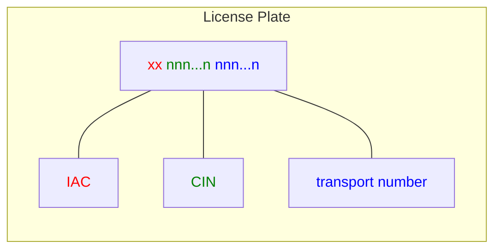
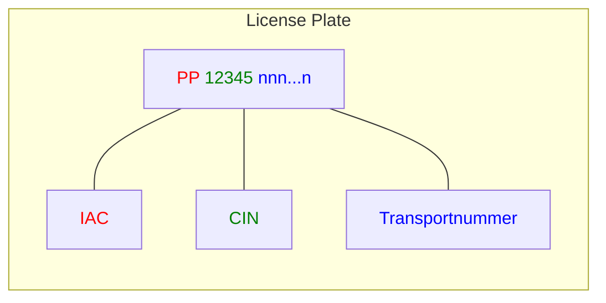

IFA CODINGSYSTEM logo

# Transport Logistics Specification

Version 1.03      April 2023

Automatic identification of transport units
in the pharmaceutical supply chain

Illustration of blue transport boxes with arrows indicating flow, and a magnifying glass showing a barcode with data (2L)CH3000+11311001 and (J)PP21435T987368X9

Transport logistics specification

IFA CODINGSYSTEM logo

# Directory

1. Foreword and introduction .................................................................................................... 2
2. Scope .................................................................................................................................... 3
3. Shipping label........................................................................................................................ 3
3.1. General ................................................................................................................................. 3
3.2. Basic shipping label .............................................................................................................. 4
3.3. Extended shipping label ........................................................................................................ 4
4. Data content and requirements ............................................................................................. 4
4.1. General ................................................................................................................................. 4
4.2. License Plate......................................................................................................................... 4
4.2.1. General rules......................................................................................................................... 4
4.2.2. Creation using the IAC of the IFA ......................................................................................... 5
4.3. Data Identifier License Plate ................................................................................................. 6
4.4. Data Identifier "ShipTo" ......................................................................................................... 6
4.5. Additional data elements ....................................................................................................... 7
5. Marking with code and clear text .......................................................................................... 7
5.1. Symbology ............................................................................................................................ 7
5.2. Further definitions ................................................................................................................. 7
5.3. Code examples ..................................................................................................................... 8
5.4. Print quality ........................................................................................................................... 8
Appendix A Glossar ............................................................................................................................... 10
Appendix B Bibliography ....................................................................................................................... 10
Appendix C Document maintenance summary ..................................................................................... 11

<page_number>Page 1 of 11</page_number>

27.04.2023

Informationsstelle für Arzneispezialitäten – IFA GmbH

<u>Directory</u>

Transport logistics specification

IFA CODINGSYSTEM logo

# 1. Foreword and introduction

In the framework of the Counterfeiting Directive 2011/62/EU (FMD) and the DELEGATED COMMISSION REGULATION (EU) 2016/161 of October 2, 2015 (DVO), it was necessary to transform the German reimbursement number (PZN), as defined in social legislation, into a globally unique product number.

For this purpose, the Informationsstelle für Arzneispezialitäten GmbH – IFA GmbH (IFA), which manages the allocation of the PZN, has acquired the status of an issuing agency and created the IFA Coding System.

The IFA Coding System covers the labeling of medicinal products, medical devices and other pharmacy-specific articles.

For this purpose, the IFA provides on behalf of the supporting associations

* **ABDA - Bundesvereinigung Deutscher Apothekerverbände e.V.**
(German Federal Association of Pharmacists)

* **Bundesverband der Arzneimittel-Hersteller e.V. (BAH)**
(German Medicines Manufacturers` Association)

* **Bundesverband der Pharmazeutischen Industrie e.V. (BPI)**
(German Pharmaceutical Industry Association)

* **Bundesverband des Pharmazeutischen Großhandels – PHAGRO e.V.**
(Association of Pharmaceutical Wholesalers)

* **Pro Generika e.V.**
(Association of Generic Medical Manufacturers)

* **Verband Forschender Arzneimittelhersteller e.V. (vfa)**
(Association of Research-Based Pharmaceutical Companies)

the following specifications, among others:

* <u>Specification PPN-Code for retail packaging</u>,

* <u>Specification Unique Device Identification (UDI)</u>,

* <u>Technical Information on PZN Coding – PZN in Code 39</u>,

* as well as the present transport logistics specification.

<page_number>Page 2 of 11</page_number>

27.04.2023

Informationsstelle für Arzneispezialitäten – IFA GmbH

[Directory](Directory)

Transport logistics specification

IFA CODINGSYSTEM logo

# 2. Scope

This document is the specification for the identification of transport units for logistical purposes, i.e. for shipping containers, shipping pallets and possibly bundle packaging (see arrows in Figure 1: Packing cascade (as in ISO/DTS 16791-2012) Figure 1).

Illustration of a packing cascade showing various levels of packaging from individual bottles/blisters to a full pallet, with arrows pointing to the larger transport units.

*Figure 1: Packing cascade (as in ISO/DTS 16791-2012)*

Figure 1 illustrates a typical packing cascade, starting with the single component (for example, a blister pack or a bottle) through to the transport pallet. For both stages of retail packaging and transport units, IFA has corresponding coding specifications, referred to as IFA Coding System.

This document specifies the elements of a shipping label according to the European Standard EN 1573 (Barcoding – Multi industry transport label) and the International Standard ISO 15394 (packaging barcode and two-dimensional symbols for shipping, transport and receiving labels) providing the sender, transporter and receiver unambiguous information and at the same time allowing an automated process.

The details of the marking and identification of the shipping units are based on the rules of transportation companies. This information is essential to allow tracking of transport units within the logistic chain.

This specification does not address the relative assignment of the packaging units themselves (parent-child relation-ship), which is required in aggregation. For this application refer to the standard "ANSI MH10.8.2; Section VI".

# 3. Shipping label

## 3.1. General

As a shipping label either the Basic Shipping Label or the Extended Shipping Label should be used. The Basic Shipping Label includes necessary logistics information for the sender, transporter and receiver. The Extended Shipping Label contains optional additional information.

<page_number>Page 3 of 11</page_number>

27.04.2023

Informationsstelle für Arzneispezialitäten – IFA GmbH

<u>[Directory](Directory)</u>

Transport logistics specification

IFA CODINGSYSTEM logo

## 3.2. Basic shipping label

The Basic Shipping label contains a unique identification of the transport unit. This identification is called "License Plate" (see Section 4.2). The structure is based upon the ISO registration procedures and the relevant underlying international standards (see Appendix B 1, 2 and 3).

If all other data e.g. the return address and the recipient‘s address are present in the databases and available in the EDI data exchange, then the license plate is the only mandatory prescribed barcode.

## 3.3. Extended shipping label

If the data in the Basic Shipping Label is insufficient then the Extended Shipping Label should be used.

In addition to the License Plate (refer to Section 4.2), the Basic Shipping Label can carry the following additional encoded data:

* Transporter notes (e.g. Transport regulations)

* Shipper‘s address

* Receiver‘s adress

* Information relating to content (e.g. product number, batch details, size or weight details)

Information on data content and structures can be found in Section 4 and the symbology in Section 5.1.

# 4. Data content and requirements

## 4.1. General

In order that the data can be interpreted unambiguously in data carriers they are to marked with Data Identifier (DI). The necessary DI are defined in the international data structure standard ISO / IEC 15418 (relating to ANSI MH10.8.2; Data Identifier and Application Identifier Standard).

In this chapter, the applicable Data Identifier (DI) is described and the respective associated data contents.

## 4.2. License Plate

### 4.2.1. General rules

To provide globally unique identification, the License Plate is generated based on ISO / IEC 15459-1. This is a unique identification number for each transport unit.

The following character blocks are arranged without separation (structure see Figure 2).

<page_number>Page 4 of 11</page_number>

27.04.2023

Informationsstelle für Arzneispezialitäten – IFA GmbH

[Directory](Directory)

Transport logistics specification

IFA CODINGSYSTEM logo

Figure 2: Basic structure of License Plate

1. In the first position is the Issuing Agency Code (IAC). This code is specific to the Issuing Agency (IA) as assigned by the Dutch Standards Institute (NEN) on behalf of ISO.

2. The second position is the identification (Company Identification Number - CIN) of the company creating the License Plate. If license plate creation is contracted out, then the client's CIN should be used. The CIN is assigned by the IA.

3. The third position is the company's uniquely generated shipment number.

## 4.2.2. Creation using the IAC of the IFA

The creation of a License Plate using the IAC of the IFA on the basis of the above rules is illustrated below:

Figure 3: Structure of a License Plate using the IAC of the IFA

1. The assigned Issuing Agency Code (IAC) **"PP"** of the IFA as Issuing Agency is used as the License Plate prefix.

2. This is followed by the IFA assigned supplier number in the form of five-digit Company-ID. This is part of the IFA Information Services (attribute "B00ADRNR"; Field Description: "Address number."), including related address and contact information. The IFA clients may request their supplier number at ifa@ifaffm.de.

3. In the third position, the number assigned by the company to the license plate. The company is responsible for ensuring the allocation of a unique number.

<page_number>Page 5 of 11</page_number>

27.04.2023

Informationsstelle für Arzneispezialitäten – IFA GmbH

[Directory](Directory)

Transport logistics specification

IFA CODINGSYSTEM logo

The total length of the license plate must have no more than 20 characters. This means that the shipment number may have up to 13 alphanumeric characters.

License Plate using the IFA’s IAC, refer to Chapter 5.3 Example 1.

# 4.3. Data Identifier License Plate

**Data Identifier: „J”**

Data Identifier (DI) for the License Plate are according to the standard ANSI MH10.8.2 (reference from ISO / IEC 15418) assigned to the Data Identifier of group "J". The ISO / IEC 15459-1 allows the use of the DI J and 1J to 6J.

In the standard application, the Data Identifier "J" should be used.

The License Plate is formed as per Section 4.2.2.

**Example:**

<table>
  <thead>
    <tr>
        <th>DI</th>
        <th>Daten</th>
    </tr>
  </thead>
  <tbody>
    <tr>
        <td>J</td>
        <td>PP123456012345678901</td>
    </tr>
  </tbody>
</table>

When it is required to differenciate between various levels of packaging (carton, pallet, container), this may be achieved using the Data Identifier 1J to 6J.

# 4.4. Data Identifier “ShipTo”

This Data Identifier designates the recipient‘s address according to a standard agreed upon between logistic partners.

Usually this is a combination of country code plus postal code plus additional address information. The Data Identifier DI "2L" is used for this combination is specified in ANSI MH10.8.2.

**Example:**

<table>
  <thead>
    <tr>
        <th>DI</th>
        <th>Daten</th>
    </tr>
  </thead>
  <tbody>
    <tr>
        <td>2L</td>
        <td>DE06618+04000000</td>
    </tr>
  </tbody>
</table>

**Alternative:**

An alternative of the recipient address can be formed through the combination of the Issuing Agency Code (IAC) from the IFA and the Company ID of the recipient. Data Identifier - DI "25L" used is per the standard ANSI MH10.8.2.

<table>
  <thead>
    <tr>
        <th>DI</th>
        <th>Daten</th>
    </tr>
  </thead>
  <tbody>
    <tr>
        <td>25L</td>
        <td>PP12345</td>
    </tr>
  </tbody>
</table>

<page_number>Page 6 of 11</page_number>

27.04.2023

Informationsstelle für Arzneispezialitäten – IFA GmbH

<u>[Directory](Directory)</u>

Transport logistics specification

IFA CODINGSYSTEM logo

"PP" is the IAC of IFA.

"12345" stands for the IFA-assigned Company ID (Customer/Supplier Number) IFA. The complete address details are available from the IFA Information Services.

IFA Clients can request their Company ID by email to ifa@ifaffm.de.

## 4.5. Additional data elements

In the case of the Extended Shipping Label where more data elements are required, they are to be agreed upon between the logistics partners. Data Identifiers should be used as per ANSI MH10.8.2 and applied as appropriate.

For hierarchical structured and EDI-compatible data content in 2D-code, the use of "PapierEDI" is recommended. (Source: Specification Paper EDI: www.eurodatacouncil.org).

# 5. Marking with code and clear text

## 5.1. Symbology

The License Plate can be coded in Code 128 or in Code 39. Code 128 in accordance with ISO/IEC 15417 is usually used.

In the Extended Shipping Label, information additional to the License Plate can be presented in 2D Codes.

We recommend using the Data Matrix code according to ISO / IEC 16022 in the 06 Format as per ISO / IEC 15434.

## 5.2. Further definitions

The code sizes result from the selected module size (bar width) and the data contained in the code. All sizes and shapes allowed within the specified standards may be used.

The specifications for code size, quiet zone (light zone), positioning, clear text information and label sizes can be found in ISO 15394. In addition, the requirements of the transport service must be observed.

<page_number>Page 7 of 11</page_number>

27.04.2023 Informationsstelle für Arzneispezialitäten – IFA GmbH [Directory](Directory)

Transport logistics specification

IFA CODINGSYSTEM logo

## 5.3. Code examples

**Example 1**

Barcode Example 1

(J) PP21435T987368X9

**License Plate** with IFA IAC "PP" and Company Identification Code "21435" (equivalent to IFA Supplier Number) followed by the transport number "T987368X9"

**Example 2**

Barcode Example 2

(J) J D00040 DHL 0001019020

**License Plate** according to DHL-Specification (Source: Barcode Specification DHL Packet V2.2_15. march 2012)

**Example 3**

Barcode Example 3 ShipTo Code

(2L) CH3000+11311001

ShipTo Code

Barcode Example 3 License Plate

(J) PP21435T987368X9

License Plate

Symbology used in the examples: Code 128 according to ISO/IEC 15417.

## 5.4. Print quality

Essential for code usability is that it can be read reliably and that the content complies with the established rules. The practical readability depends on the scanner and the operating and ambient conditions. To ensure the overall readability of a code requires a minimum print quality, defined according to a standard methodology.

The current technical standards for the determination of print quality are the international standards ISO /IEC 15415 for 2D matrix codes and ISO / IEC 15416 for Barcodes.

<page_number>Page 8 of 11</page_number>

27.04.2023

Informationsstelle für Arzneispezialitäten – IFA GmbH

[Directory](Directory)

Transport logistics specification

IFA CODINGSYSTEM logo

The classification of print quality is carried out using the table according to ISO/IEC 15415 and 15416:

Table 1: Quality grades according to ISO/IEC 15415 and 15416

<table>
  <thead>
    <tr>
        <th>ISO/IEC-Grades</th>
        <th>ANSI-Level</th>
        <th>With repeated testing</th>
        <th>Meaning</th>
    </tr>
  </thead>
  <tbody>
    <tr>
        <td>4</td>
        <td>A</td>
        <td>3,5 - 4,0</td>
        <td>Very good</td>
    </tr>
    <tr>
        <td>3</td>
        <td>B</td>
        <td>2,5 - 3,49</td>
        <td>Good</td>
    </tr>
    <tr>
        <td>2</td>
        <td>C</td>
        <td>1,5 - 2,49</td>
        <td>Satisfactory</td>
    </tr>
    <tr>
        <td>1</td>
        <td>D</td>
        <td>0,5 - 1,49</td>
        <td>Adequate</td>
    </tr>
    <tr>
        <td>0</td>
        <td>F</td>
        <td>less than 0,5</td>
        <td>Failed</td>
    </tr>
  </tbody>
</table>

**The print quality should meet the requirements of ISO 15394 and the needs of the transport services.**

<page_number>Page 9 of 11</page_number>

27.04.2023	Informationsstelle für Arzneispezialitäten – IFA GmbH	[Directory](Directory)

Transport logistics specification

IFA CODINGSYSTEM logo

# Appendix A Glossar

As a matter of principle the terms and definitions of ISO / IEC 19762 apply and the specification [http://www.ifa-coding-system.org/downloads/de/PPN_Code_Handelspackung_IFA_Spec_EN.pdf](http://www.ifa-coding-system.org/downloads/de/PPN_Code_Handelspackung_IFA_Spec_EN.pdf).

# Appendix B Bibliography

1 ISO 15394
Packaging – Barcode and two-dimensional symbols for shipping, transport and receiving labels

2 ISO/IEC 15459-1
Information technology – Unique identifiers – Part 1: Unique identifiers for transport units

3 ISO/IEC 15459-2
Information technology – Unique identifiers – Part 2: Registration procedures

4 EN 1573
Barcoding - Multi industry transport label

5 ISO/IEC 19762
Information technology – Automatic identification and data capture (AIDC) techniques – Harmonized vocabulary

6 ISO 15417
Information technology – Automatic identification and data capture techniques – Code 128 barcode symbology specification

7 ISO/IEC 15418
Information technology – Automatic identification and data capture techniques – GS1 Application Identifiers and ASC MH10 Data Identifiers and maintenance

8 ANSI MH10.8.2
Data Identifier and Application Identifier Standard

9 ISO/IEC 15434
Information technology – Automatic identification and data capture techniques – Syntax for high-capacity ADC media

10 ISO/IEC 16022
Information technology – Automatic identification and data capture techniques – Data Matrix barcode symbology specification

11 ISO/IEC 15415
Information technology – Automatic identification and data capture techniques – Barcode symbol print quality test specification -- Two-dimensional symbols

12 ISO/IEC 15416
Information technology -- Automatic identification and data capture techniques -- Barcode print quality test specification -- Linear symbols

<page_number>Page 10 of 11</page_number>

27.04.2023 Informationsstelle für Arzneispezialitäten – IFA GmbH [<u>Directory</u>](Directory)

Transport logistics specification

IFA CODINGSYSTEM logo

# Appendix C Document maintenance summary

<table>
  <thead>
    <tr>
        <th>Version</th>
        <th>Date</th>
        <th>Type of change</th>
        <th>Change</th>
    </tr>
  </thead>
  <tbody>
    <tr>
        <td>V 1.01</td>
        <td>01.09.2012</td>
        <td>First release</td>
        <td> </td>
    </tr>
    <tr>
        <td>V 1.02</td>
        <td>23.09.2020</td>
        <td>Editorial changes, harmonization of terms, layout adjustment</td>
        <td>Chapters 1 and 2, entire document</td>
    </tr>
    <tr>
        <td>V 1.03</td>
        <td>27.04.2023</td>
        <td>Link to PPN Technical Specification deleted</td>
        <td>Chapter 1</td>
    </tr>
  </tbody>
</table>

Page 11 of 11
27.04.2023	Informationsstelle für Arzneispezialitäten – IFA GmbH	[Directory](Directory)

Further information about IFA GmbH, the IFA Coding System, about PZN and PPN, about UDI as well as the technical specifications can be found at www.ifaffm.de.

The content has been created with great care. If you discover any errors or omissions, please inform us.

The following have been involved in the creation of this specification in 2012 (in alphabetical order by surname):

* Klaus Appel, (then) Informationsstelle für Arzneispezialitäten – IFA GmbH (IFA), Frankfurt/Main

* Dr. Ehrhard Anhalt, (then) Bundesverband der Arzneimittel-Hersteller (BAH), Bonn

* Heinrich Oehlmann, Eurodata Council, Naumburg / Den Haag

* Paul Rupp, (formerly Sanofi-Aventis), Schwalbach am Taunus

* Wilfried Weigelt, Company REA; Member of DIN standards committee NA 043-01-31 AA

IFA logo

Informationsstelle für Arzneispezialitäten – IFA GmbH
Hamburger Allee 26 – 28
60486 Frankfurt am Main

Tel. +49 69 979919-0
ifa@ifaffm.de
www.ifaffm.de